# Bibliography API design document

Ook will provide a bibliography API that lists all types of cite-able resources at Rubin Observatory, and includes bibliographic information for each resource.

## Database design

### Entities

Based on the unified resource model approach, I've identified the following core entities for the bibliography API:

#### 1. Resource

The central entity representing any trackable item in the system. This unified approach handles both root resources (e.g., a GitHub repository) and their versioned snapshots (e.g., tagged releases) as the same entity type.

**Attributes:**

- `id` (Primary Key): Crockford Base32 identifier stored as a 64-bit unsigned integer (uint64) in the database
- `title`: Display name/title of the resource
- `description`: Optional description
- `url`: Primary URL for the resource (if applicable)
- `resource_type`: Enumeration (GitHub_repository, document, documentation_website, etc.)
- `date_created`: Timestamp when resource was added to Ook
- `date_updated`: Timestamp of last modification
- `is_citable`: Boolean indicating if resource can be cited
- `doi`: Digital Object Identifier (nullable, for citable resources)
- `version_identifier`: Version string/tag (nullable, e.g., "v1.2.0", "2024-01-15")
- `version_type`: Enumeration (nullable, semantic_version, date_version, git_tag, etc.)
- `is_default_version`: Boolean indicating if this is the current default version
- `date_released`: When this version was released (nullable, for versioned resources)
- `type_metadata`: JSONB field for type-specific metadata (nullable)

**Resource Hierarchy Examples:**

- **Root resource**: `is_default_version = TRUE`, `version_identifier = NULL`
- **Versioned resource**: `is_default_version = FALSE`, `version_identifier = "v1.2.0"`
- **Version relationships**: Established through ResourceRelationship using DataCite relationship types

#### 2. Type-specific resource tables

These tables are related to the Resource table through joined-table inheritance, allowing for specific metadata storage while maintaining a unified resource model.

#### GitHubRepository

Represents GitHub repositories with specific metadata.

**Attributes:**

- `resource_id` (Primary Key, Foreign Key): References Resource
- `github_owner`: GitHub owner (organization or user)
- `github_name`: GitHub repository name
- `default_branch`: Default branch name (e.g., "main")
- `language`: Primary programming language of the repository (nullable)
- `stars_count`: Number of stars (nullable)
- `forks_count`: Number of forks (nullable)
- `watchers_count`: Number of watchers (nullable)
- `date_created`: Timestamp when added to system
- `date_updated`: Timestamp of last update

#### Document

Represents documents with specific metadata, such as series and handle.

**Attributes:**

- `resource_id` (Primary Key, Foreign Key): References Resource
- `series`: Series name (e.g., "DMTN", "LDM")
- `handle`: Handle identifier (e.g., "031")
- `generator`: Document generator used (e.g., `Documenteer 2.0.0`, `Lander 2.0.0`)
- `abstract`: Optional abstract or summary of the document
- `date_created`: Timestamp when added to system
- `date_updated`: Timestamp of last update

#### DocumentationWebsite

Represents documentation websites with specific metadata.
The `url` of the Resource will point to the main page of the documentation.

**Attributes:**

- `resource_id` (Primary Key, Foreign Key): References Resource
- `sitemap_url`: URL to the sitemap (if available)
- `generator`: Documentation generator used (e.g. `Documenteer 2.0.0`)
- `date_created`: Timestamp when added to system
- `date_updated`: Timestamp of last update

#### GitHubRelease

Represents GitHub releases with specific metadata.

**Attributes:**

- `resource_id` (Primary Key, Foreign Key): References Resource
- `tag`: Git tag name for the release (e.g., "v1.2.0")
- `name`: Display name of the release (nullable, often same as tag)
- `release_notes`: Markdown-formatted release notes/changelog (nullable)
- `date_created`: Timestamp when added to system
- `date_updated`: Timestamp of last update

#### PyPIPackage

Represents PyPI packages with specific metadata.

**Attributes:**

- `resource_id` (Primary Key, Foreign Key): References Resource
- `name`: PyPI package name (e.g., "lsst-daf-butler")
- `date_created`: Timestamp when added to system
- `date_updated`: Timestamp of last update

#### PyPIRelease

Represents specific PyPI package releases with version-specific metadata.

**Attributes:**

- `resource_id` (Primary Key, Foreign Key): References Resource
- `tag`: Version tag/identifier (e.g., "1.2.0", "2024.1.0")
- `date_created`: Timestamp when added to system
- `date_updated`: Timestamp of last update

#### 3. ResourceRelationship

Captures all types of relationships between resources, including citations, references, and other semantic connections. This unified approach aligns with DataCite's RelatedIdentifier model.

**Attributes:**

- `id` (Primary Key): Unique identifier
- `source_resource_id` (Foreign Key): References Resource (the "from" resource)
- `target_resource_id` (Foreign Key, nullable): References Resource (if target is in Ook)
- `external_reference_id` (Foreign Key, nullable): References ExternalReference (for external targets)
- `relationship_type`: Enumeration matching DataCite relationType values
- `citation_context`: Optional context where citation/reference appears (nullable)
- `date_created`: Timestamp when relationship was established

**DataCite-Compatible Relationship Types:**

- **Primary citation types**: `Cites`, `IsCitedBy` (most commonly used)
- **Alternative citation types**: `References`, `IsReferencedBy`, `IsSupplementTo`, `IsSupplementedBy`
- **Version relationships**: `HasVersion`, `IsVersionOf`, `IsNewVersionOf`, `IsPreviousVersionOf`
- **Content relationships**: `IsPartOf`, `HasPart`
- **Derivation relationships**: `IsDerivedFrom`, `IsSourceOf`, `IsCompiledBy`, `Compiles`
- **Documentation relationships**: `Documents`, `IsDocumentedBy`, `Describes`, `IsDescribedBy`
- **Review relationships**: `Reviews`, `IsReviewedBy`
- **Publication relationships**: `IsPublishedIn`
- **Dependency relationships**: `Requires`, `IsRequiredBy`
- **Lifecycle relationships**: `Continues`, `IsContinuedBy`, `Obsoletes`, `IsObsoletedBy`
- **Collection relationships**: `Collects`, `IsCollectedBy`
- **Translation relationships**: `IsTranslationOf`, `HasTranslation`
- **Form relationships**: `IsVariantFormOf`, `IsOriginalFormOf`, `IsIdenticalTo`
- **Metadata relationships**: `HasMetadata`, `IsMetadataFor`
- **Ook-specific types**: `generates` (for repo→docs), `implements`, `supersedes`

#### 4. ExternalReference

Stores information about resources referenced by Ook resources but not tracked in the Ook database.

**Attributes:**

- `id` (Primary Key): Unique identifier
- `doi`: DOI if available
- `url`: URL if available
- `title`: Title of the external resource
- `authors`: Author information (JSON or separate table)
- `date_published`: When external resource was published
- `resource_type`: Type of external resource (journal_article, book, website, etc.)
- `date_created`: Timestamp when added to system

#### 5. Author

Represents authors/contributors to resources. This aligns with the existing `SqlAuthor` model in the codebase.

**Attributes:**

- `id` (Primary Key): Unique identifier (BigInteger, auto-increment)
- `internal_id`: Internal ID from author database YAML (unique, indexed)
- `surname`: Surname/family name of the author (indexed)
- `given_name`: Given/first name of the author (nullable, indexed)
- `email`: Email address (nullable)
- `orcid`: ORCID identifier (nullable, unique)
- `notes`: Array of notes/alt-affiliations for AASTeX
- `date_updated`: Timestamp of last update

**Related Entities:**

- Links to `Affiliation` through `AuthorAffiliation` junction table
- Links to `Collaboration` (future enhancement)

#### 6. ResourceAuthor

Many-to-many relationship between Resources and Authors/Collaborations. This unified table allows author lists to contain a mix of individual authors and collaborations. Works uniformly for both root resources and their versions.

**Attributes:**

- `resource_id` (Foreign Key): References Resource (primary key component)
- `author_id` (Foreign Key, nullable): References Author (mutually exclusive with collaboration_id)
- `collaboration_id` (Foreign Key, nullable): References Collaboration (mutually exclusive with author_id)
- `author_order`: Order/position in author list (integer, 1-based indexing)
- `role`: Author role (author, editor, contributor, etc.)

**Constraints:**

- Exactly one of `author_id` or `collaboration_id` must be non-null (check constraint)
- Composite primary key: `(resource_id, author_order)` to ensure unique ordering
- Alternative composite unique constraint: `(resource_id, author_id)` and `(resource_id, collaboration_id)` to prevent duplicates

#### 7. Affiliation

Represents institutional affiliations for authors. This aligns with the existing `SqlAffiliation` model.

**Attributes:**

- `id` (Primary Key): Unique identifier (BigInteger, auto-increment)
- `internal_id`: Internal ID from author database YAML (unique, indexed)
- `name`: Name of the institution/affiliation (indexed)
- `address`: Physical address of the institution (nullable, indexed)
- `date_updated`: Timestamp of last update

#### 8. AuthorAffiliation

Junction table for the many-to-many relationship between Authors and Affiliations, with ordering support.

**Attributes:**

- `author_id` (Foreign Key): References Author (primary key component)
- `affiliation_id` (Foreign Key): References Affiliation (primary key component)
- `position`: Order/position of this affiliation for the author

#### 9. Collaboration

Represents research collaborations. This aligns with the existing `SqlCollaboration` model.

**Attributes:**

- `id` (Primary Key): Unique identifier (BigInteger, auto-increment)
- `internal_id`: Internal ID from author database YAML (unique, indexed)
- `name`: Name of the collaboration (indexed)
- `date_updated`: Timestamp of last update

#### 10. LtdProject

Represents projects hosted on LSST the Docs (LTD) for specific resource types like Document and DocumentationWebsite.

**Attributes:**

- `resource_id` (Primary Key, Foreign Key): References Resource
- `project_name`: Name of the LTD project (unique, indexed)
- `api_resource_url`: URL to the API resource for this project
- `domain`: Domain of the LTD project (e.g., "lsst.io", "pipelines.lsst.io")
- `date_created`: Timestamp when added to system
- `date_updated`: Timestamp of last update

### Entity Relationships Summary

1. **Resource** ↔ **ResourceRelationship** ↔ **Resource**: Many-to-many relationships including citations and versioning
2. **ResourceRelationship** ↔ **ExternalReference**: Many-to-one (multiple relationships can reference same external resource)
3. **Resource** ↔ **Type-specific tables**: One-to-one inheritance (GitHubRepository, Document, DocumentationWebsite)
4. **Resource** ↔ **Author**: Many-to-many through ResourceAuthor
5. **Resource** ↔ **Collaboration**: Many-to-many through ResourceAuthor
6. **Author** ↔ **Affiliation**: Many-to-many through AuthorAffiliation (with ordering)
7. **Author** ↔ **AuthorAffiliation**: One-to-many
8. **Affiliation** ↔ **AuthorAffiliation**: One-to-many
9. **Resource** ↔ **ResourceAuthor**: One-to-many
10. **Resource** ↔ **LtdProject**: One-to-one (optional, for LTD-hosted resources)

```mermaid
erDiagram
    Resource {
        bigint id PK
        string title
        text description
        string url
        enum resource_type
        timestamp date_created
        timestamp date_updated
        boolean is_citable
        string doi
        string version_identifier
        enum version_type
        boolean is_default_version
        timestamp date_released
        jsonb type_metadata
    }

    ResourceRelationship {
        bigint id PK
        bigint source_resource_id FK
        bigint target_resource_id FK
        bigint external_reference_id FK
        enum relationship_type
        text citation_context
        timestamp date_created
    }

    ExternalReference {
        bigint id PK
        string doi
        string url
        string title
        json authors
        timestamp date_published
        enum resource_type
        timestamp date_created
    }

    GitHubRepository {
        bigint resource_id PK,FK
        string github_owner
        string github_name
        string default_branch
        string language
        int stars_count
        int forks_count
        int watchers_count
        timestamp date_created
        timestamp date_updated
    }

    Document {
        bigint resource_id PK,FK
        string series
        string handle
        string generator
        text abstract
        timestamp date_created
        timestamp date_updated
    }

    DocumentationWebsite {
        bigint resource_id PK,FK
        string sitemap_url
        string generator
        timestamp date_created
        timestamp date_updated
    }

    GitHubRelease {
        bigint resource_id PK,FK
        string tag
        string name
        text release_notes
        timestamp date_created
        timestamp date_updated
    }

    PyPIPackage {
        bigint resource_id PK,FK
        string name
        timestamp date_created
        timestamp date_updated
    }

    PyPIRelease {
        bigint resource_id PK,FK
        string tag
        timestamp date_created
        timestamp date_updated
    }

    Author {
        bigint id PK
        string internal_id
        string surname
        string given_name
        string email
        string orcid
        string[] notes
        timestamp date_updated
    }

    ResourceAuthor {
        bigint resource_id PK,FK
        bigint author_id FK
        bigint collaboration_id FK
        int author_order
        string role
    }

    Affiliation {
        bigint id PK
        string internal_id
        string name
        string address
        timestamp date_updated
    }

    AuthorAffiliation {
        bigint author_id PK,FK
        bigint affiliation_id PK,FK
        int position
    }

    Collaboration {
        bigint id PK
        string internal_id
        string name
        timestamp date_updated
    }

    LtdProject {
        bigint resource_id PK,FK
        string project_name
        string api_resource_url
        string domain
        timestamp date_created
        timestamp date_updated
    }

    Resource ||--o{ ResourceRelationship : "source"
    Resource ||--o{ ResourceRelationship : "target"
    ResourceRelationship }o--|| ExternalReference : "references"

    Resource ||--o| GitHubRepository : "inheritance"
    Resource ||--o| Document : "inheritance"
    Resource ||--o| DocumentationWebsite : "inheritance"
    Resource ||--o| GitHubRelease : "inheritance"
    Resource ||--o| PyPIPackage : "inheritance"
    Resource ||--o| PyPIRelease : "inheritance"
    Resource ||--o| LtdProject : "hosted_on"

    Resource ||--o{ ResourceAuthor : "has"
    Author ||--o{ ResourceAuthor : "authors"
    Collaboration ||--o{ ResourceAuthor : "authors"

    Author ||--o{ AuthorAffiliation : "has"
    Affiliation ||--o{ AuthorAffiliation : "employs"
```



### Design Considerations

#### Unified Model Benefits

- **Single source of truth**: All bibliographic information (citations, authors, DOIs) handled consistently
- **Simplified queries**: No need to join Resource and ResourceVersion tables for bibliographic data
- **Flexible versioning**: Any resource can become versioned, and any version can become the default
- **API consistency**: Single endpoint pattern for all resource operations

#### Versioning Strategy

- **Root resources**: `is_default_version = TRUE`, `version_identifier = NULL`
- **Version resources**: `is_default_version = FALSE`, `version_identifier = "v1.2.0"`
- **Version relationships**: Use ResourceRelationship with DataCite types (`HasVersion`, `IsVersionOf`, etc.)
- **Version promotion**: Update `is_default_version` flags to change which version is default
- **Version queries**: Use ResourceRelationship joins to traverse version hierarchies

#### Data Integrity Constraints

- Ensure only one `is_default_version = TRUE` per resource family
- Prevent circular references in version relationships through ResourceRelationship
- Validate that versioned resources inherit compatible resource_type
- Enforce proper use of version relationship types (`HasVersion`, `IsVersionOf`, etc.)

#### Unified Relationship Model

- **DataCite compatibility**: Uses the same relationship types as DataCite's RelatedIdentifier
- **Citations as relationships**: `Cites`, `IsCitedBy`, `References`, `IsReferencedBy` are relationship types
- **Internal relationships**: Use `target_resource_id` for resources within Ook
- **External relationships**: Use `external_reference_id` for resources outside Ook
- **Contextual information**: Optional `citation_context` field for additional details
- **Bidirectional tracking**: Automatic reciprocal relationship creation where appropriate

#### Citation Type Strategy

- **Default to primary types**: Use `Cites`/`IsCitedBy` for most citation relationships
- **Semantic choice**: Allow `References`/`IsReferencedBy` for general references
- **Supplementary materials**: Use `IsSupplementedBy`/`IsSupplementTo` for datasets, appendices, etc.
- **Functional equivalence**: All citation types count equally in DataCite metrics
- **User guidance**: Provide clear guidelines on when to use each type
- **Documentation linking**: Use `References`/`IsReferencedBy` for documentation cross-links and related material pointers

See [DataCite's Contributing Citations and References](https://support.datacite.org/docs/contributing-citations-and-references) for a discussion of citations versus references.

#### Performance Optimizations

- Index on `is_default_version` for version queries
- Index on `relationship_type` in ResourceRelationship for version traversal
- Consider materialized views for complex bibliographic aggregations
- Cache latest version information for frequently accessed resources

#### Author System Integration

- Leverages existing `SqlAuthor`, `SqlAffiliation`, and `SqlCollaboration` models
- Supports complex author-affiliation relationships with ordering
- Integrates with LSST TeX author database YAML format
- Maintains backward compatibility with existing author data structures

#### Extensibility

- `resource_type` enumeration easily extended for new resource types
- `relationship_type` enumeration supports various inter-resource relationships
- JSON fields in `ExternalReference` allow flexible external metadata storage

#### Type-Specific Metadata Strategy

- **Joined-table inheritance**: Well-defined types (GitHub repos, documents) get dedicated tables
- **JSONB fallback**: `type_metadata` field for flexible/experimental metadata
- **Performance balance**: Frequently queried fields in dedicated tables, occasional fields in JSON
- **Migration strategy**: Start with JSONB, promote to dedicated tables as patterns emerge
- **Query patterns**:
  - Type-specific queries use LEFT JOINs to subtype tables
  - Cross-type queries use base Resource table
  - Hybrid queries combine both approaches

#### Type-Specific Metadata Usage

```sql
-- Create a GitHub repository with type-specific metadata
INSERT INTO Resource (title, resource_type, is_default_version, type_metadata)
VALUES ('LSST Science Pipelines', 'GitHub_repository', TRUE, '{"topics": ["astronomy", "python"]}');

INSERT INTO GitHubRepository (resource_id, github_owner, github_name, default_branch, language)
VALUES (1, 'lsst', 'pipelines', 'main', 'Python');

-- Create a document with series and handle
INSERT INTO Resource (title, resource_type, is_default_version)
VALUES ('Data Management Test Plan', 'document', TRUE);

INSERT INTO Document (resource_id, series, handle, document_type, abstract)
VALUES (2, 'DMTN', '031', 'technical_note', 'This document describes...');

-- Query GitHub repositories with metadata
SELECT r.title, gr.github_owner, gr.github_name, gr.stars_count, r.type_metadata->'topics'
FROM Resource r
JOIN GitHubRepository gr ON r.id = gr.resource_id
WHERE r.resource_type = 'GitHub_repository';

-- Query documents by series
SELECT r.title, d.series, d.handle, d.document_type
FROM Resource r
JOIN Document d ON r.id = d.resource_id
WHERE d.series = 'DMTN'
ORDER BY d.handle;
```

#### LTD Project Association Strategy

For Document and DocumentationWebsite resources that are hosted on LSST the Docs (LTD), we need to capture specific LTD metadata including project name and API resource URL. Since only some resources of these types are LTD-hosted, we recommend a hybrid approach that aligns with the existing type-specific metadata strategy.

**Recommended Approach: Dedicated LTD Table**

Create a dedicated `LtdProject` table that can be optionally joined to Document and DocumentationWebsite resources:

```sql
CREATE TABLE LtdProject (
    resource_id INTEGER PRIMARY KEY REFERENCES Resource(id),
    project_name VARCHAR NOT NULL,
    api_resource_url VARCHAR NOT NULL,
    domain VARCHAR, -- e.g., 'lsst.io', 'pipelines.lsst.io'
    date_created TIMESTAMP NOT NULL DEFAULT CURRENT_TIMESTAMP,
    date_updated TIMESTAMP NOT NULL DEFAULT CURRENT_TIMESTAMP,

    -- Ensure project names are unique
    UNIQUE(project_name)
);

-- Index for efficient querying by project name
CREATE INDEX idx_ltd_project_name ON LtdProject(project_name);
```

**Alternative Approach: JSONB Metadata Field**

For a more flexible approach, LTD metadata can be stored in the existing `type_metadata` JSONB field:

```sql
-- Example LTD metadata in type_metadata
{
    "ltd": {
        "project_name": "pipelines",
        "api_resource_url": "https://keeper.lsst.codes/projects/pipelines/",
        "domain": "pipelines.lsst.io"
    }
}
```

**Recommendation: Use Dedicated LTD Table**

The dedicated table approach is preferred because:

1. **Query Performance**: Direct SQL joins are faster than JSONB queries for frequent LTD lookups
2. **Data Integrity**: Foreign key constraints and unique constraints on project names
3. **Indexing**: Better index support for LTD-specific queries
4. **Clear Semantics**: Explicit relationship between resources and LTD projects
5. **API Efficiency**: Simpler joins for endpoints that need LTD information

**Usage Patterns:**

```sql
-- Find all LTD-hosted documents
SELECT r.title, d.series, d.handle, ltd.project_name, ltd.api_resource_url
FROM Resource r
JOIN Document d ON r.id = d.resource_id
JOIN LtdProject ltd ON r.id = ltd.resource_id
WHERE r.resource_type = 'document'
ORDER BY d.series, d.handle;

-- Find all resources for a specific LTD project
SELECT r.title, r.resource_type, r.url
FROM Resource r
JOIN LtdProject ltd ON r.id = ltd.resource_id
WHERE ltd.project_name = 'pipelines';

-- Find all LTD-hosted documentation websites
SELECT r.title, r.url, dw.sitemap_url, ltd.project_name
FROM Resource r
JOIN DocumentationWebsite dw ON r.id = dw.resource_id
JOIN LtdProject ltd ON r.id = ltd.resource_id
WHERE r.resource_type = 'documentation_website';

-- Check if a resource is LTD-hosted
SELECT r.title,
       CASE WHEN ltd.resource_id IS NOT NULL THEN 'LTD-hosted' ELSE 'External' END as hosting_type
FROM Resource r
LEFT JOIN LtdProject ltd ON r.id = ltd.resource_id
WHERE r.resource_type IN ('document', 'documentation_website');
```

**Migration Strategy:**

1. **Phase 1**: Create `LtdProject` table
2. **Phase 2**: Populate with existing LTD project data
3. **Phase 3**: Update API endpoints to include LTD information where available
4. **Phase 4**: Add validation to ensure LTD resources have proper project associations

**Benefits of This Approach:**

- **Selective Association**: Only LTD-hosted resources need entries in LtdProject table
- **Clean Queries**: Simple LEFT JOIN to determine LTD hosting status
- **Performance**: Indexed queries for LTD-specific operations
- **Consistency**: Aligns with existing joined-table inheritance pattern
- **Extensibility**: Easy to add more LTD-specific fields (build status, deployment info, etc.)
- **Data Integrity**: Unique constraints prevent duplicate project names
- **API Clarity**: Clear distinction between LTD-hosted and external resources

This approach maintains the flexibility of the hybrid metadata model while providing optimal performance and data integrity for the common use case of identifying and working with LTD-hosted resources.

#### Mixed Author and Collaboration Usage

The updated ResourceAuthor model supports mixed author lists containing both individual authors and collaborations. Here are usage examples:

```sql
-- Create a resource with mixed author list: individual authors and a collaboration
INSERT INTO Resource (title, resource_type, is_default_version)
VALUES ('LSST Data Release Processing', 'document', TRUE);

-- Add individual authors (positions 1 and 3)
INSERT INTO ResourceAuthor (resource_id, author_id, collaboration_id, author_order, role)
VALUES
    (1, 101, NULL, 1, 'author'),  -- First author (individual)
    (1, 102, NULL, 3, 'author');  -- Third author (individual)

-- Add collaboration as second author
INSERT INTO ResourceAuthor (resource_id, author_id, collaboration_id, author_order, role)
VALUES (1, NULL, 201, 2, 'author');  -- Second author (collaboration)

-- Query to get complete author list in order
SELECT
    ra.author_order,
    ra.role,
    COALESCE(a.given_name || ' ' || a.surname, c.name) as author_name,
    CASE
        WHEN ra.author_id IS NOT NULL THEN 'individual'
        WHEN ra.collaboration_id IS NOT NULL THEN 'collaboration'
    END as author_type
FROM ResourceAuthor ra
LEFT JOIN Author a ON ra.author_id = a.id
LEFT JOIN Collaboration c ON ra.collaboration_id = c.id
WHERE ra.resource_id = 1
ORDER BY ra.author_order;

-- Find all resources authored by a specific collaboration
SELECT r.title, r.resource_type, ra.author_order, ra.role
FROM Resource r
JOIN ResourceAuthor ra ON r.id = ra.resource_id
JOIN Collaboration c ON ra.collaboration_id = c.id
WHERE c.name = 'LSST Dark Energy Science Collaboration'
ORDER BY r.title, ra.author_order;

-- Find resources with mixed authorship (both individuals and collaborations)
SELECT r.title,
       COUNT(CASE WHEN ra.author_id IS NOT NULL THEN 1 END) as individual_authors,
       COUNT(CASE WHEN ra.collaboration_id IS NOT NULL THEN 1 END) as collaboration_authors
FROM Resource r
JOIN ResourceAuthor ra ON r.id = ra.resource_id
GROUP BY r.id, r.title
HAVING COUNT(CASE WHEN ra.author_id IS NOT NULL THEN 1 END) > 0
   AND COUNT(CASE WHEN ra.collaboration_id IS NOT NULL THEN 1 END) > 0;

-- Validate data integrity: ensure exactly one of author_id or collaboration_id is set
SELECT ra.*
FROM ResourceAuthor ra
WHERE (ra.author_id IS NULL AND ra.collaboration_id IS NULL)
   OR (ra.author_id IS NOT NULL AND ra.collaboration_id IS NOT NULL);
```

**Database Constraints:**

```sql
-- Check constraint to ensure exactly one of author_id or collaboration_id is set
ALTER TABLE ResourceAuthor ADD CONSTRAINT chk_author_xor_collaboration
CHECK (
    (author_id IS NOT NULL AND collaboration_id IS NULL) OR
    (author_id IS NULL AND collaboration_id IS NOT NULL)
);

-- Unique constraint to prevent duplicate author entries for the same resource
CREATE UNIQUE INDEX idx_resource_author_unique ON ResourceAuthor (resource_id, author_id)
WHERE author_id IS NOT NULL;

CREATE UNIQUE INDEX idx_resource_collaboration_unique ON ResourceAuthor (resource_id, collaboration_id)
WHERE collaboration_id IS NOT NULL;

-- Unique constraint for author ordering within a resource
CREATE UNIQUE INDEX idx_resource_author_order ON ResourceAuthor (resource_id, author_order);
```

**Benefits of This Approach:**

- **Unified author lists**: Individual authors and collaborations can be intermixed in any order
- **Consistent ordering**: Single `author_order` field maintains sequence regardless of author type
- **Data integrity**: Database constraints prevent invalid combinations
- **Query flexibility**: Can filter by author type or query all authors uniformly
- **API simplicity**: Single endpoint can return mixed author lists with type indicators
- **Citation compatibility**: Supports standard academic citation formats with mixed authorship

## REST API design

The Bibliography REST API provides comprehensive access to all bibliographic resources and their relationships. The API follows RESTful principles with consistent JSON responses and proper HTTP status codes.

> **Implementation Note**: Ook already has existing APIs for authors and affiliations. The bibliography API will extend these existing endpoints rather than replace them, ensuring backward compatibility while adding bibliographic functionality.

### API Design Principles

1. **Consistency**: All endpoints follow similar patterns for parameters, responses, and error handling
2. **Discoverability**: Include related resource links and relationship information
3. **Performance**: Efficient keyset pagination and selective field inclusion
4. **Extensibility**: JSON structure allows for future field additions without breaking changes
5. **Standards Compliance**: Follows DataCite metadata standards, RFC 5988 web linking, and academic citation formats
6. **Type Safety**: Clear typing for all resource types and relationships
7. **Infrastructure Reuse**: Leverages existing Ook APIs (authors, affiliations) and extends them for bibliographic functionality

### Base URL

```
https://roundtable.lsst.cloud/ook
```

### Authentication

Ook uses Gafaelfawr for authentication, although not all resources require authentication to access.
Mixing authenticated and unauthenticated access needs to be determined.

### Resource ID Format

The Bibliography API uses Crockford Base32 encoded IDs for all public resource identifiers. These IDs are designed to be human-readable, URL-safe, and include error detection capabilities.

**ID Specification:**

- **Format**: Crockford Base32 encoding with hyphen separators
- **Length**: 14 characters total (formatted as XXXX-XXXX-XXXX-XX)
  - 12 characters: Resource identifier
  - 2 characters: Checksum for error detection (as implemented by `base32-lib`)
- **Separator**: Hyphens every 4 characters for readability
- **Implementation**: Uses the [base32-lib](https://base32-lib.readthedocs.io/en/latest/) Python library
- **Example**: `01AR-YZ6S-3XQW-FG` (12 chars + 2 char checksum with hyphens)

**Database Storage:**

- Resource IDs are stored as 64-bit unsigned integer primary keys in PostgreSQL (decoded from the 12-character Crockford Base32 string)
- The 12-character Crockford Base32 strings (without checksums) are decoded to an integer for storage
- Checksums are calculated and appended dynamically by the API layer when serving responses
- Checksums are validated and stripped by the API layer when processing incoming requests
- This approach leverages PostgreSQL's optimization for integer data and maintains natural sort ordering

**Benefits:**

- **URL-safe**: No special characters that require encoding
- **Human-readable**: Avoids ambiguous characters (0/O, 1/I/l)
- **Error detection**: Built-in checksum prevents typos in manual entry
- **Storage efficient**: 8 bytes (uint64) vs 12+ bytes for string storage
- **Natural ordering**: Crockford Base32 preserves lexicographic order, perfect for keyset pagination
- **PostgreSQL optimized**: Integer primary keys are very fast for indexing and joins
- **Collision resistance**: Low probability of ID conflicts

**Usage in API:**

- All `{id}` parameters in endpoints use Crockford Base32 IDs with checksums and hyphens
- API layer validates incoming IDs by checking checksums, then strips checksums and decodes to an integer
- API layer encodes database integers to Base32, appends checksums, and formats with hyphens for responses
- Database queries use integer comparisons for optimal performance
- Keyset pagination uses natural integer ordering: `WHERE id > decode_base32($cursor) ORDER BY id`

### Pagination

The API uses keyset pagination (also known as cursor-based pagination) rather than offset-based pagination for better performance and consistency with large datasets.

#### Keyset Pagination Implementation

**Request Parameters:**

- `limit`: Number of results per page (default: varies by endpoint, max: 100)
- `cursor`: Opaque cursor token for the next page (optional for first page)

**Response Headers:**

- `Link`: Contains pagination URLs following RFC 5988 web linking standard
- `X-Total-Count`: Total number of items available (optional, may be omitted for performance)

**Link Header Format:**

```
Link: <https://roundtable.lsst.cloud/ook/resources?cursor=eyJpZCI6MTUwfQ&limit=50>; rel="next",
      <https://roundtable.lsst.cloud/ook/resources?cursor=eyJpZCI6MX0&limit=50>; rel="prev",
      <https://roundtable.lsst.cloud/ook/resources?limit=50>; rel="first"
```

**Cursor Implementation:**

- Cursors are base64-encoded strings containing the last resource ID from the current page
- For resources: Cursor contains the Crockford Base32 ID (e.g., `01AR-YZ6S-3XQW-F`)
- Database queries use binary comparison: `WHERE id > decode_base32($cursor) ORDER BY id`
- Natural ordering is maintained since Crockford Base32 preserves lexicographic sort order
- For search results: `{"score": 0.95, "id": "01AR-YZ6S-3XQW-F"}` (sorted by relevance score, then ID)
- For authors: `{"surname": "Smith", "id": 101}` (sorted by surname, then ID)

**Pagination Flow:**

1. **First request**: `GET /resources?limit=50`
2. **Next page**: Use `next` rel link from Link header
3. **Previous page**: Use `prev` rel link from Link header
4. **First page**: Use `first` rel link from Link header

**Benefits over Offset Pagination:**

- **Consistent results**: No duplicate or missing items when data changes during pagination
- **Better performance**: Efficient database queries using indexed sort keys
- **Scalability**: Performance doesn't degrade with large offsets
- **Real-time safe**: Works correctly when items are added/removed during pagination

**Client Implementation Example:**

```javascript
async function fetchAllResources() {
  let nextUrl = "/resources?limit=50";
  const allResources = [];

  while (nextUrl) {
    const response = await fetch(nextUrl);
    const data = await response.json();
    allResources.push(...data);

    // Parse Link header for next page
    const linkHeader = response.headers.get("Link");
    nextUrl = parseLinkHeader(linkHeader)?.next || null;
  }

  return allResources;
}
```

### Response Format Standards

#### Success Responses

- **200 OK**: Successful GET requests
- **201 Created**: Successful POST requests
- **204 No Content**: Successful DELETE requests

#### Error Responses

- **400 Bad Request**: Invalid request parameters
- **401 Unauthorized**: Missing or invalid authentication
- **403 Forbidden**: Insufficient permissions
- **404 Not Found**: Resource not found
- **422 Unprocessable Entity**: Validation errors
- **500 Internal Server Error**: Server errors

#### Error Response Format

```json
{
  "error": {
    "code": "VALIDATION_ERROR",
    "message": "Invalid resource type specified",
    "details": {
      "field": "resource_type",
      "allowed_values": [
        "github_repository",
        "document",
        "documentation_website"
      ]
    }
  }
}
```

### Endpoints

#### 1. Resources

##### GET /resources

List all bibliographic resources with filtering and pagination.

**Query Parameters:**

- `resource_type` (optional): Filter by resource type (github_repository, document, documentation_website)
- `is_citable` (optional): Filter by citability (true/false)
- `author` (optional): Filter by author name or ID
- `collaboration` (optional): Filter by collaboration name or ID
- `doi` (optional): Filter by DOI
- `series` (optional): Filter documents by series (e.g., "DMTN")
- `limit` (optional): Number of results per page (default: 50, max: 100)
- `cursor` (optional): Keyset pagination cursor for next page
- `include_versions` (optional): Include all versions or just default (default: false)

**Response:**

```json
[
  {
    "id": "01AR-YZ6S-3XQW-F",
    "self_url": "https://roundtable.lsst.cloud/ook/resources/01AR-YZ6S-3XQW-F",
    "title": "LSST Science Pipelines",
    "description": "The LSST Science Pipelines enable optical and near-infrared astronomy",
    "url": "https://github.com/lsst/science_pipelines",
    "resource_type": "github_repository",
    "date_created": "2024-01-15T10:30:00Z",
    "date_updated": "2024-06-15T14:20:00Z",
    "is_citable": true,
    "doi": "10.5281/zenodo.12345678",
    "version_identifier": null,
    "version_type": null,
    "is_default_version": true,
    "date_released": null,
    "authors": [
      {
        "type": "individual",
        "order": 1,
        "role": "author",
        "author": {
          "self_url": "https://roundtable.lsst.cloud/ook/authors/102",
          "given_name": "John",
          "surname": "Doe",
          "orcid": "0000-0000-0000-0001"
        }
      },
      {
        "type": "collaboration",
        "order": 2,
        "role": "author",
        "collaboration": {
          "self_url": "https://roundtable.lsst.cloud/ook/authors/201",
          "name": "LSST Data Management Team"
        }
      }
    ],
    "github_repository": {
      "github_owner": "lsst",
      "github_name": "science_pipelines",
      "default_branch": "main",
      "language": "Python",
      "stars_count": 245,
      "forks_count": 89
    },
    "ltd_project": null
  }
]
```

**Response Headers:**

```
Link: <https://roundtable.lsst.cloud/ook/resources?cursor=eyJpZCI6MTUwfQ&limit=50>; rel="next"
X-Total-Count: 150
```

##### GET /resources/{id}

Get a specific resource by ID with full details.

**Response:**

```json
{
  "id": "01BS-WQM7-Y8PD-C",
  "self_url": "https://roundtable.lsst.cloud/ook/resources/01BS-WQM7-Y8PD-C",
  "title": "Data Management Test Plan",
  "description": "Technical note describing the test approach for LSST Data Management",
  "url": "https://dmtn-031.lsst.io",
  "resource_type": "document",
  "date_created": "2024-01-20T09:15:00Z",
  "date_updated": "2024-03-10T16:45:00Z",
  "is_citable": true,
  "doi": "10.5281/zenodo.87654321",
  "version_identifier": "v2.1",
  "version_type": "semantic_version",
  "is_default_version": true,
  "date_released": "2024-03-10T16:45:00Z",
  "authors_url": "https://roundtable.lsst.cloud/ook/resources/01BS-WQM7-Y8PD-C/authors",
  "versions_url": "https://roundtable.lsst.cloud/ook/resources/01BS-WQM7-Y8PD-C/versions",
  "relationships_url": "https://roundtable.lsst.cloud/ook/resources/01BS-WQM7-Y8PD-C/relationships",
  "citations_url": "https://roundtable.lsst.cloud/ook/resources/01BS-WQM7-Y8PD-C/citations",
  "document": {
    "series": "DMTN",
    "handle": "031",
    "generator": "Documenteer 2.0.0",
    "abstract": "This document describes the comprehensive testing approach..."
  },
  "ltd_project": {
    "project_name": "dmtn-031",
    "api_resource_url": "https://keeper.lsst.codes/projects/dmtn-031/",
    "domain": "lsst.io"
  }
}
```

###### Export records with content negotiation

A user can export bibliographic records in various formats using content negotiation. The `Accept` header specifies the desired format:

- `Accept: application/json` for JSON (default)
- `Accept: application/x-bibtex` for BibTeX
- `Accept: application/vnd.citationstyles.csl+json` for Citation Style Language (CSL) JSON
- `Accept: application/vnd.codemeta.ld+json` for CodeMeta JSON

The content nogation is intended to be simmilar to how [Crossref](https://www.crossref.org/documentation/retrieve-metadata/content-negotiation/) and [DataCite](https://support.datacite.org/docs/datacite-content-resolver) handle content negotiation.

##### GET /resources/{id}/versions

Get all related versions of a specific resource.

> ![NOTE] Could this be merged with the existing `/resources/{id}/relationships` endpoint?

**Response:**

```json
[
  {
    "self_url": "https://roundtable.lsst.cloud/ook/resources/3",
    "version_identifier": "v1.0",
    "is_default_version": false,
    "date_released": "2024-01-20T09:15:00Z",
    "url": "https://dmtn-031.lsst.io/v/v1.0"
  },
  {
    "self_url": "https://roundtable.lsst.cloud/ook/resources/5",
    "version_identifier": "v2.1",
    "is_default_version": true,
    "date_released": "2024-03-10T16:45:00Z",
    "url": "https://dmtn-031.lsst.io"
  }
]
```

##### GET /resources/{id}/authors

Get all authors (individuals and collaborations) for a specific resource.

**Query Parameters:**

- `type` (optional): Filter by type ("person", "collaboration", or "all" - default: "all")
- `role` (optional): Filter by authorship role (author, editor, contributor, etc.)
- `limit` (optional): Number of results per page (default: 50)
- `cursor` (optional): Keyset pagination cursor for next page

**Response:**

```json
[
  {
    "type": "person",
    "order": 1,
    "role": "author",
    "author": {
      "id": 102,
      "given_name": "Jane",
      "surname": "Smith",
      "orcid": "0000-0000-0000-0002",
      "affiliations": [
        {
          "name": "Rubin Observatory",
          "self_url": "https://roundtable.lsst.cloud/ook/affiliations/301",
          "address": "950 N Cherry Ave, Tucson, AZ 85721"
        }
      ]
    }
  },
  {
    "type": "collaboration",
    "order": 2,
    "role": "author",
    "collaboration": {
      "self_url": "https://roundtable.lsst.cloud/ook/authors/201",
      "name": "LSST Data Management Team"
    }
  }
]
```

**Response Headers:**

```
Link: <https://roundtable.lsst.cloud/ook/resources/2/authors?cursor=eyJvcmRlciI6Mn0&limit=50>; rel="next"
X-Total-Count: 3
```

##### GET /resources/{id}/relationships

Get all relationships for a specific resource.

**Query Parameters:**

- `type` (optional): Filter by relationship type

**Response:**

```json
[
  {
    "relationship_type": "References",
    "resource": {
      "title": "LSST System Requirements",
      "url": "https://lse-029.lsst.io",
      "resource_type": "document",
      "self_url": "https://roundtable.lsst.cloud/ook/resources/5"
    }
  },
  {
    "relationship_type": "Cites",
    "external_resource": {
      "title": "Astronomical Data Analysis Software and Systems",
      "doi": "10.48550/arXiv.astro-ph/0309692",
      "authors": "Smith, J. et al.",
      "resource_type": "journal_article"
    }
  },
  {
    "relationship_type": "IsCitedBy",
    "resource": {
      "self_url": "https://roundtable.lsst.cloud/ook/resources/6",
      "title": "LSST Data Release Procedures",
      "url": "https://dmtn-045.lsst.io",
      "resource_type": "document"
    }
  }
]
```

#### 2. Authors

> **Note**: Ook already has an existing authors API implementation. The bibliography API will extend this existing API to include bibliographic resource relationships and coalesce individual authors and collaborations into a unified authorship model.

##### GET /authors

List all authors with keyset pagination.

**Current Implementation:**

- Endpoint: `GET /authors`
- Pagination: Uses `cursor` and `limit` parameters
- Response headers: `Link` header for pagination, `X-Total-Count` for total count
- Returns: List of authors with basic information

**Proposed Bibliography Extensions:**

- Add `type` field to distinguish between "person" and "collaboration" (see unified approach in Collaborations section)
- Add `resource_count` field showing number of associated bibliographic resources
- Add optional `include_resources` parameter to include resource relationships
- Add filtering by `affiliation`, `orcid`, `surname`, and `type`

**Query Parameters:**

- `type` (optional): Filter by type ("person", "collaboration", or "all" - default: "all")
- `surname` (optional): Filter by surname (for persons) or name (for collaborations)
- `orcid` (optional): Filter by ORCID ID (persons only)
- `affiliation` (optional): Filter by affiliation name
- `limit` (optional): Number of results per page (default: 50)
- `cursor` (optional): Keyset pagination cursor for next page

**Response:**

```json
[
  {
    "self_url": "https://roundtable.lsst.cloud/ook/authors/john-doe",
    "type": "person",
    "internal_id": "john-doe",
    "given_name": "John",
    "surname": "Doe",
    "orcid": "0000-0000-0000-0001",
    "affiliations": [
      {
        "self_url": "https://roundtable.lsst.cloud/ook/affiliations/301",
        "name": "Rubin Observatory",
        "address": "950 N Cherry Ave, Tucson, AZ 85721",
        "position": 1
      }
    ],
    "resource_count": 15
  },
  {
    "self_url": "https://roundtable.lsst.cloud/ook/authors/dm-team",
    "type": "collaboration",
    "internal_id": "dm-team",
    "name": "LSST Data Management Team",
    "given_name": null,
    "surname": null,
    "orcid": null,
    "affiliations": [],
    "resource_count": 42
  }
]
```

**Response Headers:**

```
Link: <https://roundtable.lsst.cloud/ook/authors?cursor=eyJpZCI6MjAxfQ&limit=50>; rel="next"
X-Total-Count: 178
```

##### GET /authors/{internal_id}

Get detailed information about a specific author by their internal ID.

**Current Implementation:**

- Endpoint: `GET /authors/{internal_id}`
- Path parameter: `internal_id` (from lsst-texmf authordb.yaml)
- Returns: Author details including affiliations
- Security: Excludes sensitive data like email addresses

**Proposed Bibliography Extensions:**

- Add `resources` endpoint showing authored bibliographic resources

**Integration with Bibliography System:**

The bibliography API will leverage the existing authors infrastructure and extend it with:

1. **ResourceAuthor relationships**: Link existing authors to bibliographic resources
2. **Mixed authorship support**: Handle both individual authors and collaborations
3. **Resource metadata**: Include bibliographic context (author order, role, citation info)
4. **Cross-references**: Enable navigation from authors to their resources and vice versa

**Example Extended Response:**

```json
{
  "self_url": "https://roundtable.lsst.cloud/ook/authors/john-doe",
  "type": "person",
  "internal_id": "john-doe",
  "given_name": "John",
  "surname": "Doe",
  "orcid": "0000-0000-0000-0001",
  "affiliations": [
    {
      "self_url": "https://roundtable.lsst.cloud/ook/affiliations/301",
      "name": "Rubin Observatory",
      "address": "950 N Cherry Ave, Tucson, AZ 85721",
      "position": 1
    }
  ],
  "resources_url": "https://roundtable.lsst.cloud/ook/authors/john-doe/resources"
}
```

Extended to handle both individual authors and collaborations by internal ID.

**Response for Individual Author:**

```json
{
  "self_url": "https://roundtable.lsst.cloud/ook/authors/john-doe",
  "type": "person",
  "internal_id": "john-doe",
  "given_name": "John",
  "surname": "Doe",
  "orcid": "0000-0000-0000-0001",
  "affiliations": [
    {
      "id": 301,
      "name": "Rubin Observatory",
      "address": "950 N Cherry Ave, Tucson, AZ 85721",
      "position": 1
    }
  ],
  "resource_count": 15,
  "resources_url": "https://roundtable.lsst.cloud/ook/authors/john-doe/resources"
}
```

**Response for Collaboration:**

```json
{
  "self_url": "https://roundtable.lsst.cloud/ook/authors/dm-team",
  "type": "collaboration",
  "internal_id": "dm-team",
  "name": "LSST Data Management Team",
  "given_name": null,
  "surname": null,
  "orcid": null,
  "affiliations": [],
  "resource_count": 42,
  "resources_url": "https://roundtable.lsst.cloud/ook/authors/dm-team/resources"
}
```

**Benefits of Unified Approach:**

1. **Simplified Client Logic**: Single endpoint for all authorship queries
2. **Consistent Pagination**: Same cursor-based pagination for both types
3. **Unified Filtering**: Search across both persons and collaborations simultaneously
4. **Type Safety**: Clear `type` field distinguishes between persons and collaborations
5. **Backward Compatibility**: Existing author API consumers can filter by `type=person`
6. **Future Extensibility**: Easy to add new authorship types (e.g., organizations, institutions)

**Implementation Strategy:**

1. **Phase 1**: Add `type` field to existing authors API responses
2. **Phase 2**: Extend authors service to include collaborations
3. **Phase 3**: Add `type` query parameter for filtering
4. **Phase 4**: Optionally add legacy `/collaborations` endpoints as convenience wrappers
5. **Phase 5**: Update ResourceAuthor relationships to work with unified model

##### GET /authors/{internal_id}/resources

Get all bibliographic resources authored by a specific author or collaboration.

**Query Parameters:**

- `type` (optional): Filter by resource type (github_repository, document, documentation_website)
- `role` (optional): Filter by authorship role (author, editor, contributor, etc.)
- `limit` (optional): Number of results per page (default: 50)
- `cursor` (optional): Keyset pagination cursor for next page

**Response:**

```json
[
  {
    "order": 1,
    "role": "author",
    "resource": {
      "self_url": "https://roundtable.lsst.cloud/ook/resources/1",
      "url": "https://github.com/lsst/science_pipelines",
      "type": "github_repository",
      "is_citable": true,
      "doi": "10.5281/zenodo.12345678",
      "date_created": "2024-01-15T10:30:00Z",
      "date_updated": "2024-06-15T14:20:00Z"
    }
  },
  {
    "order": 2,
    "role": "contributor",
    "resource": {
      "self_url": "https://roundtable.lsst.cloud/ook/resources/2",
      "url": "https://dmtn-045.lsst.io",
      "is_citable": true,
      "title": "Observatory Control System Design",
      "type": "document",
      "doi": "10.5281/zenodo.87654322",
      "date_created": "2024-02-20T11:15:00Z",
      "date_updated": "2024-04-10T15:30:00Z"
    }
  }
]
```

**Response Headers:**

```
Link: <https://roundtable.lsst.cloud/ook/authors/john-doe/resources?cursor=eyJpZCI6N30&limit=50>; rel="next"
X-Total-Count: 15
```

#### 3. Search and Discovery

##### GET /search

Full-text search across all resources.

**Query Parameters:**

- `q` (required): Search query
- `resource_type` (optional): Filter by resource type
- `limit` (optional): Number of results (default: 20)
- `cursor` (optional): Keyset pagination cursor for next page

**Response:**

```json
[
  {
    "id": 2,
    "title": "Data Management Test Plan",
    "resource_type": "document",
    "snippet": "This document describes the comprehensive testing approach for LSST <em>data management</em> systems...",
    "score": 0.95,
    "url": "https://dmtn-031.lsst.io"
  }
]
```

**Response Headers:**

```
Link: <https://roundtable.lsst.cloud/ook/search?q=data%20management&cursor=eyJzY29yZSI6MC45NSwiaWQiOjJ9&limit=20>; rel="next"
X-Total-Count: 12
X-Search-Query: data management
```

#### 5. Statistics and Metrics

##### GET /stats

Get bibliography statistics.

**Response:**

```json
{
  "resources": {
    "total": 156,
    "by_type": {
      "github_repository": 45,
      "document": 89,
      "documentation_website": 22
    },
    "citable": 134,
    "with_doi": 98
  },
  "authors": {
    "total": 89,
    "with_orcid": 67
  },
  "collaborations": {
    "total": 8
  },
  "relationships": {
    "total": 245,
    "citations": 156,
    "references": 89
  }
}
```
