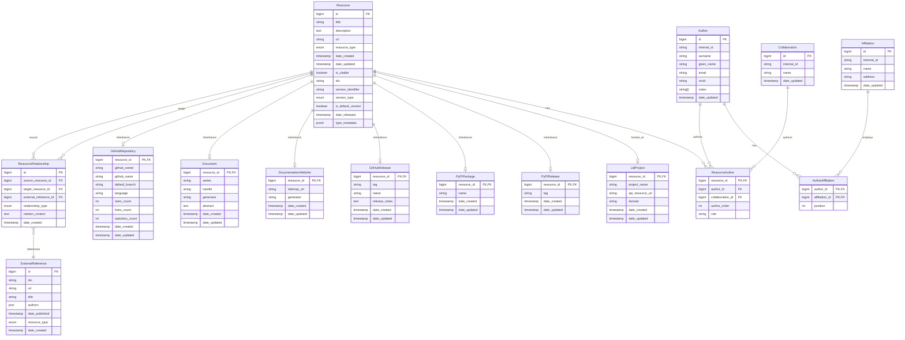

# Bibliography API design document

Ook will provide a bibliography API that lists all types of cite-able resources at Rubin Observatory, and includes bibliographic information for each resource.

## Implementation status

> [!NOTE]
> Status recorded 2026-07-04. The resources API MVP shipped in **Ook 0.18.0 (2025-07-29)** via migration `1ad667eab84e_add_resource_tables`. The resources surface has not changed materially since; later releases added author aliases (0.22.0) and author fuzzy search. Design sections below carry `> **Status:**` callouts where the implementation diverged from the original design. See also the "Design issues and risks" section for defects found in a 2026-07 review.

### Entity status

| Planned item | Status | Notes |
| --- | --- | --- |
| Crockford Base32 IDs (12 chars + 2-char checksum, integer in DB, `base32-lib`) | ✅ Implemented | `src/ook/domain/base32id.py` (`Base32Id` Pydantic type); checksums added/stripped at the API layer. IDs are **randomly generated** at ingest, not monotonic (see status note in the ID section). |
| Unified `resource` table with joined-table inheritance | ✅ Implemented | `src/ook/dbschema/resources.py`; SQLAlchemy polymorphic inheritance on a `resource_class` discriminator. |
| Document subtype | ✅ Implemented | `document_resource`: `series`, `handle` (unique), `generator`, plus an unplanned `number` column for numeric series sorting. |
| Resource versioning/citability columns (`is_citable`, `version_identifier`, `version_type`, `is_default_version`, `date_released`, `type_metadata`) | ❌ Not implemented | Only a free-form `version` string plus DataCite version relations. There is no default-version machinery (see design issue 2.1). |
| ResourceRelationship | ✅ Implemented as `resource_relation` | Column renames (`related_resource_id`, `related_external_ref_id`, `relation_type`); `citation_context`, `date_created`, and the Ook-specific relation types were dropped. Full DataCite `RelationType` vocabulary implemented. |
| ExternalReference | ✅ Implemented, richer than planned | DataCite RelatedItem-shaped: `doi`/`arxiv_id`/`isbn`/`issn`/`ads_bibcode` identifiers, bibliographic fields, JSON `contributors` with ORCID/ROR. |
| ResourceAuthor | ✅ Implemented as `contributor` | DataCite contributorType roles plus a synthetic `Creator` role for authors; unique `(resource_id, order, role)`. **No collaboration support** — the `collaboration` table was dropped (migration `113ced7d2d29`). |
| GitHubRepository, DocumentationWebsite, GitHubRelease, PyPIPackage, PyPIRelease subtypes | ❌ Not implemented | `ResourceClass` enum currently has only `generic` and `document`. |
| LtdProject | ❌ Not implemented | Now also a prerequisite for links-API correlation (see below). |
| Author / Affiliation / AuthorAffiliation | ✅ Pre-existing | Extended beyond plan with author aliases and pg_trgm fuzzy search. |

### Endpoint status

| Endpoint | Status |
| --- | --- |
| `GET /resources/{id}` | ✅ Implemented (`src/ook/handlers/resources/endpoints.py`). Returns `GenericResource \| DocumentResource` with `self_url`, record-provenance `metadata` dates, `creators`, `contributors` grouped by role, and an inlined `related` array (internal summaries or full external references). |
| `POST /ingest/resources/documents` | ✅ Implemented (was not in this plan) — bulk document ingest that mints IDs and upserts contributors/relations. |
| `GET /resources` (list/filter) | ❌ Route missing. `ResourceStore.get_resources` and the service method exist (and the 0.18.0 changelog claims the endpoint), but no route was registered. The backing list pipeline is also N+1 (design issue 3.1). |
| `GET /resources/{id}/versions` / `/authors` / `/relationships` | ❌ Not implemented; the MVP inlines this data in the detail response instead. |
| Content negotiation (BibTeX / CSL JSON / CodeMeta) | ❌ Not implemented. |
| `GET /authors`, `GET /authors/{internal_id}` | ✅ Pre-existing, with keyset pagination, `Link`/`X-Total-Count` headers, and a later fuzzy `?search=` param. The bibliography extensions (`type`, `resource_count`, affiliation/ORCID filters) are not implemented. |
| `GET /authors/{internal_id}/resources` | ❌ Not implemented. |
| `GET /search`, `GET /stats` | ❌ Not implemented. |

### Vocabulary differences (plan → code)

- The plan's single `resource_type` was split into two orthogonal fields: `resource_class` (Ook's polymorphic discriminator: `generic`, `document`) and `type` (DataCite resourceTypeGeneral vocabulary, 32 values, `src/ook/domain/resources/_type.py`).
- `ResourceAuthor` → `contributor` (`SqlContributor`), with `ContributorRole` = DataCite contributorType values + `Creator`.
- `ResourceRelationship` → `resource_relation` (`SqlResourceRelation`); `target_resource_id` → `related_resource_id`; `external_reference_id` → `related_external_ref_id`; `relationship_type` → `relation_type`.
- Date semantics were clarified: `date_created`/`date_updated` are database-record provenance; `date_resource_published`/`date_resource_updated` describe the artifact itself.

### Test coverage

`tests/handlers/resources/resources_endpoints_test.py` (ingest+get round trip, related resources, invalid IDs) and `tests/domain/base32id_test.py` (15 tests). There are no dedicated resource storage-layer tests, and `tests/dbschema_test.py` does not cover the resource tables.

## Database design

### Entities

Based on the unified resource model approach, I've identified the following core entities for the bibliography API:

#### 1. Resource

The central entity representing any trackable item in the system. This unified approach handles both root resources (e.g., a GitHub repository) and their versioned snapshots (e.g., tagged releases) as the same entity type.

**Attributes:**

- `id` (Primary Key): Crockford Base32 identifier stored as a 64-bit unsigned integer (uint64) in the database
- `title`: Display name/title of the resource
- `description`: Optional description
- `url`: Primary URL for the resource (if applicable)
- `resource_type`: Enumeration (GitHub_repository, document, documentation_website, etc.)
- `date_created`: Timestamp when resource was added to Ook
- `date_updated`: Timestamp of last modification
- `is_citable`: Boolean indicating if resource can be cited
- `doi`: Digital Object Identifier (nullable, for citable resources)
- `version_identifier`: Version string/tag (nullable, e.g., "v1.2.0", "2024-01-15")
- `version_type`: Enumeration (nullable, semantic_version, date_version, git_tag, etc.)
- `is_default_version`: Boolean indicating if this is the current default version
- `date_released`: When this version was released (nullable, for versioned resources)
- `type_metadata`: JSONB field for type-specific metadata (nullable)

> **Status:** Implemented columns are `id`, `resource_class` (polymorphic discriminator), `title`, `description`, `url`, `doi` (unique), `type` (DataCite resourceTypeGeneral), `version` (free-form string), `date_resource_published`, `date_resource_updated`, plus DB-record `date_created`/`date_updated`. The versioning/citability columns (`is_citable`, `version_identifier`, `version_type`, `is_default_version`, `date_released`) and `type_metadata` JSONB were **not** implemented — versioning is currently expressible only through DataCite relations plus the `version` string. The data model therefore cannot yet answer "what is the default version of DMTN-031"; see design issue 2.1 for the resource-family redesign this implies.

**Resource Hierarchy Examples:**

- **Root resource**: `is_default_version = TRUE`, `version_identifier = NULL`
- **Versioned resource**: `is_default_version = FALSE`, `version_identifier = "v1.2.0"`
- **Version relationships**: Established through ResourceRelationship using DataCite relationship types

#### 2. Type-specific resource tables

These tables are related to the Resource table through joined-table inheritance, allowing for specific metadata storage while maintaining a unified resource model.

> **Status:** Only the Document subtype exists (`document_resource`, with an added `number` column for numeric series sorting). GitHubRepository, DocumentationWebsite, GitHubRelease, PyPIPackage, and PyPIRelease remain unbuilt. Note that adding each subtype requires a migration plus coordinated edits to the polymorphic query utilities (`storage/resourcestore/_queryutils.py`), store dispatch, and handler response unions — see design issue 2.7 on the real cost of extending joined-table inheritance.

#### GitHubRepository

Represents GitHub repositories with specific metadata.

**Attributes:**

- `resource_id` (Primary Key, Foreign Key): References Resource
- `github_owner`: GitHub owner (organization or user)
- `github_name`: GitHub repository name
- `default_branch`: Default branch name (e.g., "main")
- `language`: Primary programming language of the repository (nullable)
- `stars_count`: Number of stars (nullable)
- `forks_count`: Number of forks (nullable)
- `watchers_count`: Number of watchers (nullable)
- `date_created`: Timestamp when added to system
- `date_updated`: Timestamp of last update

#### Document

Represents documents with specific metadata, such as series and handle.

**Attributes:**

- `resource_id` (Primary Key, Foreign Key): References Resource
- `series`: Series name (e.g., "DMTN", "LDM")
- `handle`: Handle identifier (e.g., "031")
- `generator`: Document generator used (e.g., `Documenteer 2.0.0`, `Lander 2.0.0`)
- `abstract`: Optional abstract or summary of the document
- `date_created`: Timestamp when added to system
- `date_updated`: Timestamp of last update

#### DocumentationWebsite

Represents documentation websites with specific metadata.
The `url` of the Resource will point to the main page of the documentation.

**Attributes:**

- `resource_id` (Primary Key, Foreign Key): References Resource
- `sitemap_url`: URL to the sitemap (if available)
- `generator`: Documentation generator used (e.g. `Documenteer 2.0.0`)
- `date_created`: Timestamp when added to system
- `date_updated`: Timestamp of last update

#### GitHubRelease

Represents GitHub releases with specific metadata.

**Attributes:**

- `resource_id` (Primary Key, Foreign Key): References Resource
- `tag`: Git tag name for the release (e.g., "v1.2.0")
- `name`: Display name of the release (nullable, often same as tag)
- `release_notes`: Markdown-formatted release notes/changelog (nullable)
- `date_created`: Timestamp when added to system
- `date_updated`: Timestamp of last update

#### PyPIPackage

Represents PyPI packages with specific metadata.

**Attributes:**

- `resource_id` (Primary Key, Foreign Key): References Resource
- `name`: PyPI package name (e.g., "lsst-daf-butler")
- `date_created`: Timestamp when added to system
- `date_updated`: Timestamp of last update

#### PyPIRelease

Represents specific PyPI package releases with version-specific metadata.

**Attributes:**

- `resource_id` (Primary Key, Foreign Key): References Resource
- `tag`: Version tag/identifier (e.g., "1.2.0", "2024.1.0")
- `date_created`: Timestamp when added to system
- `date_updated`: Timestamp of last update

#### 3. ResourceRelationship

Captures all types of relationships between resources, including citations, references, and other semantic connections. This unified approach aligns with DataCite's RelatedIdentifier model.

**Attributes:**

- `id` (Primary Key): Unique identifier
- `source_resource_id` (Foreign Key): References Resource (the "from" resource)
- `target_resource_id` (Foreign Key, nullable): References Resource (if target is in Ook)
- `external_reference_id` (Foreign Key, nullable): References ExternalReference (for external targets)
- `relationship_type`: Enumeration matching DataCite relationType values
- `citation_context`: Optional context where citation/reference appears (nullable)
- `date_created`: Timestamp when relationship was established

> **Status:** Implemented as `resource_relation` with `related_resource_id`/`related_external_ref_id` and a `chk_exactly_one_related` check constraint enforcing exactly one target. `citation_context`, `date_created`, and the Ook-specific relation types were dropped; the full DataCite `RelationType` vocabulary (36 values) is implemented. Known defects: the `uq_resource_relation` unique constraint is ineffective because NULL columns never conflict under PostgreSQL's default semantics (design issue 1.2), and `related_resource_id` has no index, so reverse traversals are sequential scans (design issue 3.2).

**DataCite-Compatible Relationship Types:**

- **Primary citation types**: `Cites`, `IsCitedBy` (most commonly used)
- **Alternative citation types**: `References`, `IsReferencedBy`, `IsSupplementTo`, `IsSupplementedBy`
- **Version relationships**: `HasVersion`, `IsVersionOf`, `IsNewVersionOf`, `IsPreviousVersionOf`
- **Content relationships**: `IsPartOf`, `HasPart`
- **Derivation relationships**: `IsDerivedFrom`, `IsSourceOf`, `IsCompiledBy`, `Compiles`
- **Documentation relationships**: `Documents`, `IsDocumentedBy`, `Describes`, `IsDescribedBy`
- **Review relationships**: `Reviews`, `IsReviewedBy`
- **Publication relationships**: `IsPublishedIn`
- **Dependency relationships**: `Requires`, `IsRequiredBy`
- **Lifecycle relationships**: `Continues`, `IsContinuedBy`, `Obsoletes`, `IsObsoletedBy`
- **Collection relationships**: `Collects`, `IsCollectedBy`
- **Translation relationships**: `IsTranslationOf`, `HasTranslation`
- **Form relationships**: `IsVariantFormOf`, `IsOriginalFormOf`, `IsIdenticalTo`
- **Metadata relationships**: `HasMetadata`, `IsMetadataFor`
- **Ook-specific types**: `generates` (for repo→docs), `implements`, `supersedes`

#### 4. ExternalReference

Stores information about resources referenced by Ook resources but not tracked in the Ook database.

**Attributes:**

- `id` (Primary Key): Unique identifier
- `doi`: DOI if available
- `url`: URL if available
- `title`: Title of the external resource
- `authors`: Author information (JSON or separate table)
- `date_published`: When external resource was published
- `resource_type`: Type of external resource (journal_article, book, website, etc.)
- `date_created`: Timestamp when added to system

> **Status:** Implemented richer than designed, shaped after DataCite's RelatedItem: identifier columns `doi`, `arxiv_id`, `isbn`, `issn`, `ads_bibcode` (each unique) plus a non-unique `url`; bibliographic fields (`publication_year`, `volume`, `issue`, `number`, `number_type`, `first_page`, `last_page`, `publisher`, `edition`); and `contributors` stored as JSON with ORCID/ROR support. Two defects: the upsert path does `ON CONFLICT (url)` against a column with no unique index (design issue 1.3), and orphaned external references are never garbage-collected (design issue 2.5).

#### 5. Author

Represents authors/contributors to resources. This aligns with the existing `SqlAuthor` model in the codebase.

**Attributes:**

- `id` (Primary Key): Unique identifier (BigInteger, auto-increment)
- `internal_id`: Internal ID from author database YAML (unique, indexed)
- `surname`: Surname/family name of the author (indexed)
- `given_name`: Given/first name of the author (nullable, indexed)
- `email`: Email address (nullable)
- `orcid`: ORCID identifier (nullable, unique)
- `notes`: Array of notes/alt-affiliations for AASTeX
- `date_updated`: Timestamp of last update

**Related Entities:**

- Links to `Affiliation` through `AuthorAffiliation` junction table
- Links to `Collaboration` (future enhancement)

#### 6. ResourceAuthor

Many-to-many relationship between Resources and Authors/Collaborations. This unified table allows author lists to contain a mix of individual authors and collaborations. Works uniformly for both root resources and their versions.

**Attributes:**

- `resource_id` (Foreign Key): References Resource (primary key component)
- `author_id` (Foreign Key, nullable): References Author (mutually exclusive with collaboration_id)
- `collaboration_id` (Foreign Key, nullable): References Collaboration (mutually exclusive with author_id)
- `author_order`: Order/position in author list (integer, 1-based indexing)
- `role`: Author role (author, editor, contributor, etc.)

**Constraints:**

- Exactly one of `author_id` or `collaboration_id` must be non-null (check constraint)
- Composite primary key: `(resource_id, author_order)` to ensure unique ordering
- Alternative composite unique constraint: `(resource_id, author_id)` and `(resource_id, collaboration_id)` to prevent duplicates

> **Status:** Implemented as the `contributor` table with a surrogate primary key and unique `(resource_id, order, role)` — ordering is per role, and roles use the DataCite contributorType vocabulary plus a synthetic `Creator` role for authors. The surrogate key plus delete-and-reinsert upserts sidesteps the reordering trap inherent in the `(resource_id, author_order)` composite PK described above. However, **collaboration support was dropped** (the `collaboration` table was removed in migration `113ced7d2d29` days before the resource tables landed), so the mixed author lists this section describes are currently unrepresentable — see design issue 2.4.

#### 7. Affiliation

Represents institutional affiliations for authors. This aligns with the existing `SqlAffiliation` model.

**Attributes:**

- `id` (Primary Key): Unique identifier (BigInteger, auto-increment)
- `internal_id`: Internal ID from author database YAML (unique, indexed)
- `name`: Name of the institution/affiliation (indexed)
- `address`: Physical address of the institution (nullable, indexed)
- `date_updated`: Timestamp of last update

#### 8. AuthorAffiliation

Junction table for the many-to-many relationship between Authors and Affiliations, with ordering support.

**Attributes:**

- `author_id` (Foreign Key): References Author (primary key component)
- `affiliation_id` (Foreign Key): References Affiliation (primary key component)
- `position`: Order/position of this affiliation for the author

#### 9. Collaboration

Represents research collaborations. This aligns with the existing `SqlCollaboration` model.

**Attributes:**

- `id` (Primary Key): Unique identifier (BigInteger, auto-increment)
- `internal_id`: Internal ID from author database YAML (unique, indexed)
- `name`: Name of the collaboration (indexed)
- `date_updated`: Timestamp of last update

#### 10. LtdProject

Represents projects hosted on LSST the Docs (LTD) for specific resource types like Document and DocumentationWebsite.

**Attributes:**

- `resource_id` (Primary Key, Foreign Key): References Resource
- `project_name`: Name of the LTD project (unique, indexed)
- `api_resource_url`: URL to the API resource for this project
- `domain`: Domain of the LTD project (e.g., "lsst.io", "pipelines.lsst.io")
- `date_created`: Timestamp when added to system
- `date_updated`: Timestamp of last update

> **Status:** Not implemented. This table (together with the DocumentationWebsite subtype) is now also a prerequisite for correlating the links API with bibliographic resources — see "Correlating with the links API (SQR-086)" below.

### Entity Relationships Summary

1. **Resource** ↔ **ResourceRelationship** ↔ **Resource**: Many-to-many relationships including citations and versioning
2. **ResourceRelationship** ↔ **ExternalReference**: Many-to-one (multiple relationships can reference same external resource)
3. **Resource** ↔ **Type-specific tables**: One-to-one inheritance (GitHubRepository, Document, DocumentationWebsite)
4. **Resource** ↔ **Author**: Many-to-many through ResourceAuthor
5. **Resource** ↔ **Collaboration**: Many-to-many through ResourceAuthor
6. **Author** ↔ **Affiliation**: Many-to-many through AuthorAffiliation (with ordering)
7. **Author** ↔ **AuthorAffiliation**: One-to-many
8. **Affiliation** ↔ **AuthorAffiliation**: One-to-many
9. **Resource** ↔ **ResourceAuthor**: One-to-many
10. **Resource** ↔ **LtdProject**: One-to-one (optional, for LTD-hosted resources)


```mermaid
erDiagram
    Resource {
        bigint id PK
        string title
        text description
        string url
        enum resource_type
        timestamp date_created
        timestamp date_updated
        boolean is_citable
        string doi
        string version_identifier
        enum version_type
        boolean is_default_version
        timestamp date_released
        jsonb type_metadata
    }

    ResourceRelationship {
        bigint id PK
        bigint source_resource_id FK
        bigint target_resource_id FK
        bigint external_reference_id FK
        enum relationship_type
        text citation_context
        timestamp date_created
    }

    ExternalReference {
        bigint id PK
        string doi
        string url
        string title
        json authors
        timestamp date_published
        enum resource_type
        timestamp date_created
    }

    GitHubRepository {
        bigint resource_id PK,FK
        string github_owner
        string github_name
        string default_branch
        string language
        int stars_count
        int forks_count
        int watchers_count
        timestamp date_created
        timestamp date_updated
    }

    Document {
        bigint resource_id PK,FK
        string series
        string handle
        string generator
        text abstract
        timestamp date_created
        timestamp date_updated
    }

    DocumentationWebsite {
        bigint resource_id PK,FK
        string sitemap_url
        string generator
        timestamp date_created
        timestamp date_updated
    }

    GitHubRelease {
        bigint resource_id PK,FK
        string tag
        string name
        text release_notes
        timestamp date_created
        timestamp date_updated
    }

    PyPIPackage {
        bigint resource_id PK,FK
        string name
        timestamp date_created
        timestamp date_updated
    }

    PyPIRelease {
        bigint resource_id PK,FK
        string tag
        timestamp date_created
        timestamp date_updated
    }

    Author {
        bigint id PK
        string internal_id
        string surname
        string given_name
        string email
        string orcid
        string[] notes
        timestamp date_updated
    }

    ResourceAuthor {
        bigint resource_id PK,FK
        bigint author_id FK
        bigint collaboration_id FK
        int author_order
        string role
    }

    Affiliation {
        bigint id PK
        string internal_id
        string name
        string address
        timestamp date_updated
    }

    AuthorAffiliation {
        bigint author_id PK,FK
        bigint affiliation_id PK,FK
        int position
    }

    Collaboration {
        bigint id PK
        string internal_id
        string name
        timestamp date_updated
    }

    LtdProject {
        bigint resource_id PK,FK
        string project_name
        string api_resource_url
        string domain
        timestamp date_created
        timestamp date_updated
    }

    Resource ||--o{ ResourceRelationship : "source"
    Resource ||--o{ ResourceRelationship : "target"
    ResourceRelationship }o--|| ExternalReference : "references"

    Resource ||--o| GitHubRepository : "inheritance"
    Resource ||--o| Document : "inheritance"
    Resource ||--o| DocumentationWebsite : "inheritance"
    Resource ||--o| GitHubRelease : "inheritance"
    Resource ||--o| PyPIPackage : "inheritance"
    Resource ||--o| PyPIRelease : "inheritance"
    Resource ||--o| LtdProject : "hosted_on"

    Resource ||--o{ ResourceAuthor : "has"
    Author ||--o{ ResourceAuthor : "authors"
    Collaboration ||--o{ ResourceAuthor : "authors"

    Author ||--o{ AuthorAffiliation : "has"
    Affiliation ||--o{ AuthorAffiliation : "employs"
```

### Design Considerations

#### Unified Model Benefits

- **Single source of truth**: All bibliographic information (citations, authors, DOIs) handled consistently
- **Simplified queries**: No need to join Resource and ResourceVersion tables for bibliographic data
- **Flexible versioning**: Any resource can become versioned, and any version can become the default
- **API consistency**: Single endpoint pattern for all resource operations

#### Versioning Strategy

- **Root resources**: `is_default_version = TRUE`, `version_identifier = NULL`
- **Version resources**: `is_default_version = FALSE`, `version_identifier = "v1.2.0"`
- **Version relationships**: Use ResourceRelationship with DataCite types (`HasVersion`, `IsVersionOf`, etc.)
- **Version promotion**: Update `is_default_version` flags to change which version is default
- **Version queries**: Use ResourceRelationship joins to traverse version hierarchies

#### Data Integrity Constraints

- Ensure only one `is_default_version = TRUE` per resource family
- Prevent circular references in version relationships through ResourceRelationship
- Validate that versioned resources inherit compatible resource_type
- Enforce proper use of version relationship types (`HasVersion`, `IsVersionOf`, etc.)

#### Unified Relationship Model

- **DataCite compatibility**: Uses the same relationship types as DataCite's RelatedIdentifier
- **Citations as relationships**: `Cites`, `IsCitedBy`, `References`, `IsReferencedBy` are relationship types
- **Internal relationships**: Use `target_resource_id` for resources within Ook
- **External relationships**: Use `external_reference_id` for resources outside Ook
- **Contextual information**: Optional `citation_context` field for additional details
- **Bidirectional tracking**: Automatic reciprocal relationship creation where appropriate

#### Citation Type Strategy

- **Default to primary types**: Use `Cites`/`IsCitedBy` for most citation relationships
- **Semantic choice**: Allow `References`/`IsReferencedBy` for general references
- **Supplementary materials**: Use `IsSupplementedBy`/`IsSupplementTo` for datasets, appendices, etc.
- **Functional equivalence**: All citation types count equally in DataCite metrics
- **User guidance**: Provide clear guidelines on when to use each type
- **Documentation linking**: Use `References`/`IsReferencedBy` for documentation cross-links and related material pointers

See [DataCite's Contributing Citations and References](https://support.datacite.org/docs/contributing-citations-and-references) for a discussion of citations versus references.

#### Performance Optimizations

- Index on `is_default_version` for version queries
- Index on `relationship_type` in ResourceRelationship for version traversal
- Consider materialized views for complex bibliographic aggregations
- Cache latest version information for frequently accessed resources

#### Author System Integration

- Leverages existing `SqlAuthor`, `SqlAffiliation`, and `SqlCollaboration` models
- Supports complex author-affiliation relationships with ordering
- Integrates with LSST TeX author database YAML format
- Maintains backward compatibility with existing author data structures

#### Extensibility

- `resource_type` enumeration easily extended for new resource types
- `relationship_type` enumeration supports various inter-resource relationships
- JSON fields in `ExternalReference` allow flexible external metadata storage

#### Type-Specific Metadata Strategy

- **Joined-table inheritance**: Well-defined types (GitHub repos, documents) get dedicated tables
- **JSONB fallback**: `type_metadata` field for flexible/experimental metadata
- **Performance balance**: Frequently queried fields in dedicated tables, occasional fields in JSON
- **Migration strategy**: Start with JSONB, promote to dedicated tables as patterns emerge
- **Query patterns**:
  - Type-specific queries use LEFT JOINs to subtype tables
  - Cross-type queries use base Resource table
  - Hybrid queries combine both approaches

#### Type-Specific Metadata Usage

```sql
-- Create a GitHub repository with type-specific metadata
INSERT INTO Resource (title, resource_type, is_default_version, type_metadata)
VALUES ('LSST Science Pipelines', 'GitHub_repository', TRUE, '{"topics": ["astronomy", "python"]}');

INSERT INTO GitHubRepository (resource_id, github_owner, github_name, default_branch, language)
VALUES (1, 'lsst', 'pipelines', 'main', 'Python');

-- Create a document with series and handle
INSERT INTO Resource (title, resource_type, is_default_version)
VALUES ('Data Management Test Plan', 'document', TRUE);

INSERT INTO Document (resource_id, series, handle, document_type, abstract)
VALUES (2, 'DMTN', '031', 'technical_note', 'This document describes...');

-- Query GitHub repositories with metadata
SELECT r.title, gr.github_owner, gr.github_name, gr.stars_count, r.type_metadata->'topics'
FROM Resource r
JOIN GitHubRepository gr ON r.id = gr.resource_id
WHERE r.resource_type = 'GitHub_repository';

-- Query documents by series
SELECT r.title, d.series, d.handle, d.document_type
FROM Resource r
JOIN Document d ON r.id = d.resource_id
WHERE d.series = 'DMTN'
ORDER BY d.handle;
```

#### LTD Project Association Strategy

For Document and DocumentationWebsite resources that are hosted on LSST the Docs (LTD), we need to capture specific LTD metadata including project name and API resource URL. Since only some resources of these types are LTD-hosted, we recommend a hybrid approach that aligns with the existing type-specific metadata strategy.

**Recommended Approach: Dedicated LTD Table**

Create a dedicated `LtdProject` table that can be optionally joined to Document and DocumentationWebsite resources:

```sql
CREATE TABLE LtdProject (
    resource_id INTEGER PRIMARY KEY REFERENCES Resource(id),
    project_name VARCHAR NOT NULL,
    api_resource_url VARCHAR NOT NULL,
    domain VARCHAR, -- e.g., 'lsst.io', 'pipelines.lsst.io'
    date_created TIMESTAMP NOT NULL DEFAULT CURRENT_TIMESTAMP,
    date_updated TIMESTAMP NOT NULL DEFAULT CURRENT_TIMESTAMP,

    -- Ensure project names are unique
    UNIQUE(project_name)
);

-- Index for efficient querying by project name
CREATE INDEX idx_ltd_project_name ON LtdProject(project_name);
```

**Alternative Approach: JSONB Metadata Field**

For a more flexible approach, LTD metadata can be stored in the existing `type_metadata` JSONB field:

```sql
-- Example LTD metadata in type_metadata
{
    "ltd": {
        "project_name": "pipelines",
        "api_resource_url": "https://keeper.lsst.codes/projects/pipelines/",
        "domain": "pipelines.lsst.io"
    }
}
```

**Recommendation: Use Dedicated LTD Table**

The dedicated table approach is preferred because:

1. **Query Performance**: Direct SQL joins are faster than JSONB queries for frequent LTD lookups
2. **Data Integrity**: Foreign key constraints and unique constraints on project names
3. **Indexing**: Better index support for LTD-specific queries
4. **Clear Semantics**: Explicit relationship between resources and LTD projects
5. **API Efficiency**: Simpler joins for endpoints that need LTD information

**Usage Patterns:**

```sql
-- Find all LTD-hosted documents
SELECT r.title, d.series, d.handle, ltd.project_name, ltd.api_resource_url
FROM Resource r
JOIN Document d ON r.id = d.resource_id
JOIN LtdProject ltd ON r.id = ltd.resource_id
WHERE r.resource_type = 'document'
ORDER BY d.series, d.handle;

-- Find all resources for a specific LTD project
SELECT r.title, r.resource_type, r.url
FROM Resource r
JOIN LtdProject ltd ON r.id = ltd.resource_id
WHERE ltd.project_name = 'pipelines';

-- Find all LTD-hosted documentation websites
SELECT r.title, r.url, dw.sitemap_url, ltd.project_name
FROM Resource r
JOIN DocumentationWebsite dw ON r.id = dw.resource_id
JOIN LtdProject ltd ON r.id = ltd.resource_id
WHERE r.resource_type = 'documentation_website';

-- Check if a resource is LTD-hosted
SELECT r.title,
       CASE WHEN ltd.resource_id IS NOT NULL THEN 'LTD-hosted' ELSE 'External' END as hosting_type
FROM Resource r
LEFT JOIN LtdProject ltd ON r.id = ltd.resource_id
WHERE r.resource_type IN ('document', 'documentation_website');
```

**Migration Strategy:**

1. **Phase 1**: Create `LtdProject` table
2. **Phase 2**: Populate with existing LTD project data
3. **Phase 3**: Update API endpoints to include LTD information where available
4. **Phase 4**: Add validation to ensure LTD resources have proper project associations

**Benefits of This Approach:**

- **Selective Association**: Only LTD-hosted resources need entries in LtdProject table
- **Clean Queries**: Simple LEFT JOIN to determine LTD hosting status
- **Performance**: Indexed queries for LTD-specific operations
- **Consistency**: Aligns with existing joined-table inheritance pattern
- **Extensibility**: Easy to add more LTD-specific fields (build status, deployment info, etc.)
- **Data Integrity**: Unique constraints prevent duplicate project names
- **API Clarity**: Clear distinction between LTD-hosted and external resources

This approach maintains the flexibility of the hybrid metadata model while providing optimal performance and data integrity for the common use case of identifying and working with LTD-hosted resources.

#### Mixed Author and Collaboration Usage

The updated ResourceAuthor model supports mixed author lists containing both individual authors and collaborations. Here are usage examples:

```sql
-- Create a resource with mixed author list: individual authors and a collaboration
INSERT INTO Resource (title, resource_type, is_default_version)
VALUES ('LSST Data Release Processing', 'document', TRUE);

-- Add individual authors (positions 1 and 3)
INSERT INTO ResourceAuthor (resource_id, author_id, collaboration_id, author_order, role)
VALUES
    (1, 101, NULL, 1, 'author'),  -- First author (individual)
    (1, 102, NULL, 3, 'author');  -- Third author (individual)

-- Add collaboration as second author
INSERT INTO ResourceAuthor (resource_id, author_id, collaboration_id, author_order, role)
VALUES (1, NULL, 201, 2, 'author');  -- Second author (collaboration)

-- Query to get complete author list in order
SELECT
    ra.author_order,
    ra.role,
    COALESCE(a.given_name || ' ' || a.surname, c.name) as author_name,
    CASE
        WHEN ra.author_id IS NOT NULL THEN 'individual'
        WHEN ra.collaboration_id IS NOT NULL THEN 'collaboration'
    END as author_type
FROM ResourceAuthor ra
LEFT JOIN Author a ON ra.author_id = a.id
LEFT JOIN Collaboration c ON ra.collaboration_id = c.id
WHERE ra.resource_id = 1
ORDER BY ra.author_order;

-- Find all resources authored by a specific collaboration
SELECT r.title, r.resource_type, ra.author_order, ra.role
FROM Resource r
JOIN ResourceAuthor ra ON r.id = ra.resource_id
JOIN Collaboration c ON ra.collaboration_id = c.id
WHERE c.name = 'LSST Dark Energy Science Collaboration'
ORDER BY r.title, ra.author_order;

-- Find resources with mixed authorship (both individuals and collaborations)
SELECT r.title,
       COUNT(CASE WHEN ra.author_id IS NOT NULL THEN 1 END) as individual_authors,
       COUNT(CASE WHEN ra.collaboration_id IS NOT NULL THEN 1 END) as collaboration_authors
FROM Resource r
JOIN ResourceAuthor ra ON r.id = ra.resource_id
GROUP BY r.id, r.title
HAVING COUNT(CASE WHEN ra.author_id IS NOT NULL THEN 1 END) > 0
   AND COUNT(CASE WHEN ra.collaboration_id IS NOT NULL THEN 1 END) > 0;

-- Validate data integrity: ensure exactly one of author_id or collaboration_id is set
SELECT ra.*
FROM ResourceAuthor ra
WHERE (ra.author_id IS NULL AND ra.collaboration_id IS NULL)
   OR (ra.author_id IS NOT NULL AND ra.collaboration_id IS NOT NULL);
```

**Database Constraints:**

```sql
-- Check constraint to ensure exactly one of author_id or collaboration_id is set
ALTER TABLE ResourceAuthor ADD CONSTRAINT chk_author_xor_collaboration
CHECK (
    (author_id IS NOT NULL AND collaboration_id IS NULL) OR
    (author_id IS NULL AND collaboration_id IS NOT NULL)
);

-- Unique constraint to prevent duplicate author entries for the same resource
CREATE UNIQUE INDEX idx_resource_author_unique ON ResourceAuthor (resource_id, author_id)
WHERE author_id IS NOT NULL;

CREATE UNIQUE INDEX idx_resource_collaboration_unique ON ResourceAuthor (resource_id, collaboration_id)
WHERE collaboration_id IS NOT NULL;

-- Unique constraint for author ordering within a resource
CREATE UNIQUE INDEX idx_resource_author_order ON ResourceAuthor (resource_id, author_order);
```

**Benefits of This Approach:**

- **Unified author lists**: Individual authors and collaborations can be intermixed in any order
- **Consistent ordering**: Single `author_order` field maintains sequence regardless of author type
- **Data integrity**: Database constraints prevent invalid combinations
- **Query flexibility**: Can filter by author type or query all authors uniformly
- **API simplicity**: Single endpoint can return mixed author lists with type indicators
- **Citation compatibility**: Supports standard academic citation formats with mixed authorship

## REST API design

The Bibliography REST API provides comprehensive access to all bibliographic resources and their relationships. The API follows RESTful principles with consistent JSON responses and proper HTTP status codes.

> **Implementation Note**: Ook already has existing APIs for authors and affiliations. The bibliography API will extend these existing endpoints rather than replace them, ensuring backward compatibility while adding bibliographic functionality.

### API Design Principles

1. **Consistency**: All endpoints follow similar patterns for parameters, responses, and error handling
2. **Discoverability**: Include related resource links and relationship information
3. **Performance**: Efficient keyset pagination and selective field inclusion
4. **Extensibility**: JSON structure allows for future field additions without breaking changes
5. **Standards Compliance**: Follows DataCite metadata standards, RFC 5988 web linking, and academic citation formats
6. **Type Safety**: Clear typing for all resource types and relationships
7. **Infrastructure Reuse**: Leverages existing Ook APIs (authors, affiliations) and extends them for bibliographic functionality

### Base URL

```
https://roundtable.lsst.cloud/ook
```

### Authentication

Ook uses Gafaelfawr for authentication, although not all resources require authentication to access.
Mixing authenticated and unauthenticated access needs to be determined.

> **Status:** This is now pressing rather than future work: `POST /ingest/resources/documents` is live, and its write protection rides on Gafaelfawr ingress configuration rather than anything stated in this design. This document should specify the scope model for ingest/admin routes versus anonymous read access.

### Resource ID Format

The Bibliography API uses Crockford Base32 encoded IDs for all public resource identifiers. These IDs are designed to be human-readable, URL-safe, and include error detection capabilities.

**ID Specification:**

- **Format**: Crockford Base32 encoding with hyphen separators
- **Length**: 14 characters total (formatted as XXXX-XXXX-XXXX-XX)
  - 12 characters: Resource identifier
  - 2 characters: Checksum for error detection (as implemented by `base32-lib`)
- **Separator**: Hyphens every 4 characters for readability
- **Implementation**: Uses the [base32-lib](https://base32-lib.readthedocs.io/en/latest/) Python library
- **Example**: `01AR-YZ6S-3XQW-FG` (12 chars + 2 char checksum with hyphens)

**Database Storage:**

- Resource IDs are stored as 64-bit unsigned integer primary keys in PostgreSQL (decoded from the 12-character Crockford Base32 string)
- The 12-character Crockford Base32 strings (without checksums) are decoded to an integer for storage
- Checksums are calculated and appended dynamically by the API layer when serving responses
- Checksums are validated and stripped by the API layer when processing incoming requests
- This approach leverages PostgreSQL's optimization for integer data and maintains natural sort ordering

**Benefits:**

- **URL-safe**: No special characters that require encoding
- **Human-readable**: Avoids ambiguous characters (0/O, 1/I/l)
- **Error detection**: Built-in checksum prevents typos in manual entry
- **Storage efficient**: 8 bytes (uint64) vs 12+ bytes for string storage
- **Natural ordering**: Crockford Base32 preserves the lexicographic order of the underlying integers — but note that the implemented IDs are randomly generated, so this ordering is arbitrary in practice (see Status note below and design issue 2.3)
- **PostgreSQL optimized**: Integer primary keys are very fast for indexing and joins
- **Collision resistance**: Low probability of ID conflicts

**Usage in API:**

- All `{id}` parameters in endpoints use Crockford Base32 IDs with checksums and hyphens
- API layer validates incoming IDs by checking checksums, then strips checksums and decodes to an integer
- API layer encodes database integers to Base32, appends checksums, and formats with hyphens for responses
- Database queries use integer comparisons for optimal performance
- Keyset pagination uses natural integer ordering: `WHERE id > decode_base32($cursor) ORDER BY id`

> **Status:** Implemented in `src/ook/domain/base32id.py` as a `Base32Id` annotated Pydantic type (validators/serializers handle checksums and hyphens), with `base32-lib` doing encode/decode; handlers and storage deal in plain integers. IDs are minted with `base32_lib.generate()` — i.e., **random**, not time-ordered — and currently in the ingest request model (`DocumentRequest.to_domain`) rather than in the storage layer. Two consequences to revisit: keyset ordering over random IDs is a meaningless shuffle (a ULID/Snowflake-style time-ordered integer encoded as Crockford Base32 would keep every stated benefit and restore useful ordering), and minting IDs before checking for an existing record breaks ingest idempotency (design issue 1.1).

### Pagination

The API uses keyset pagination (also known as cursor-based pagination) rather than offset-based pagination for better performance and consistency with large datasets.

> **Status:** Implemented via Safir's `CountedPaginatedQueryRunner` and `PaginationCursor` — live for `/authors`, and built for resources in `ResourceStore.get_resources` (though no list route exposes it yet). Actual cursors are plain Safir-style strings (`"{id}"` / `"p__{id}"`), not the base64-encoded JSON described below. Also note that emitting `X-Total-Count` on every page runs a `COUNT(*)` per request, which undercuts the point of keyset pagination at scale — see design issue 3.3 for making the count opt-in.

#### Keyset Pagination Implementation

**Request Parameters:**

- `limit`: Number of results per page (default: varies by endpoint, max: 100)
- `cursor`: Opaque cursor token for the next page (optional for first page)

**Response Headers:**

- `Link`: Contains pagination URLs following RFC 5988 web linking standard
- `X-Total-Count`: Total number of items available (optional, may be omitted for performance)

**Link Header Format:**

```
Link: <https://roundtable.lsst.cloud/ook/resources?cursor=eyJpZCI6MTUwfQ&limit=50>; rel="next",
      <https://roundtable.lsst.cloud/ook/resources?cursor=eyJpZCI6MX0&limit=50>; rel="prev",
      <https://roundtable.lsst.cloud/ook/resources?limit=50>; rel="first"
```

**Cursor Implementation:**

- Cursors are base64-encoded strings containing the last resource ID from the current page
- For resources: Cursor contains the Crockford Base32 ID (e.g., `01AR-YZ6S-3XQW-F`)
- Database queries use binary comparison: `WHERE id > decode_base32($cursor) ORDER BY id`
- Natural ordering is maintained since Crockford Base32 preserves lexicographic sort order
- For search results: `{"score": 0.95, "id": "01AR-YZ6S-3XQW-F"}` (sorted by relevance score, then ID)
- For authors: `{"surname": "Smith", "id": 101}` (sorted by surname, then ID)

**Pagination Flow:**

1. **First request**: `GET /resources?limit=50`
2. **Next page**: Use `next` rel link from Link header
3. **Previous page**: Use `prev` rel link from Link header
4. **First page**: Use `first` rel link from Link header

**Benefits over Offset Pagination:**

- **Consistent results**: No duplicate or missing items when data changes during pagination
- **Better performance**: Efficient database queries using indexed sort keys
- **Scalability**: Performance doesn't degrade with large offsets
- **Real-time safe**: Works correctly when items are added/removed during pagination

**Client Implementation Example:**

```javascript
async function fetchAllResources() {
  let nextUrl = "/resources?limit=50";
  const allResources = [];

  while (nextUrl) {
    const response = await fetch(nextUrl);
    const data = await response.json();
    allResources.push(...data);

    // Parse Link header for next page
    const linkHeader = response.headers.get("Link");
    nextUrl = parseLinkHeader(linkHeader)?.next || null;
  }

  return allResources;
}
```

### Response Format Standards

#### Success Responses

- **200 OK**: Successful GET requests
- **201 Created**: Successful POST requests
- **204 No Content**: Successful DELETE requests

#### Error Responses

- **400 Bad Request**: Invalid request parameters
- **401 Unauthorized**: Missing or invalid authentication
- **403 Forbidden**: Insufficient permissions
- **404 Not Found**: Resource not found
- **422 Unprocessable Entity**: Validation errors
- **500 Internal Server Error**: Server errors

#### Error Response Format

```json
{
  "error": {
    "code": "VALIDATION_ERROR",
    "message": "Invalid resource type specified",
    "details": {
      "field": "resource_type",
      "allowed_values": [
        "github_repository",
        "document",
        "documentation_website"
      ]
    }
  }
}
```

> **Status:** Superseded. The implementation (correctly) does not use this custom envelope: Ook returns Safir's `ErrorModel` / FastAPI-style `{"detail": [...]}` errors, consistent with the rest of the application. Treat the Safir convention as the standard going forward.

### Endpoints

> **Status:** Only `GET /resources/{id}` and the (unplanned) `POST /ingest/resources/documents` ingest endpoint are implemented — see the endpoint table in the Implementation status section. The sub-resource endpoints (`/versions`, `/authors`, `/relationships`) were effectively replaced in the MVP by inlining `creators`, `contributors`, and `related` into the detail response; whether to keep that inlined shape or add paginated sub-resource endpoints as author/relation lists grow is an open question. This plan also specifies no write/ingest endpoints at all — the ingest contract (batch semantics, partial-failure reporting, idempotency) needs to be designed here rather than existing only in code.

#### 1. Resources

##### GET /resources

List all bibliographic resources with filtering and pagination.

**Query Parameters:**

- `resource_type` (optional): Filter by resource type (github_repository, document, documentation_website)
- `is_citable` (optional): Filter by citability (true/false)
- `author` (optional): Filter by author name or ID
- `collaboration` (optional): Filter by collaboration name or ID
- `doi` (optional): Filter by DOI
- `series` (optional): Filter documents by series (e.g., "DMTN")
- `limit` (optional): Number of results per page (default: 50, max: 100)
- `cursor` (optional): Keyset pagination cursor for next page
- `include_versions` (optional): Include all versions or just default (default: false)

**Response:**

```json
[
  {
    "id": "01AR-YZ6S-3XQW-F",
    "self_url": "https://roundtable.lsst.cloud/ook/resources/01AR-YZ6S-3XQW-F",
    "title": "LSST Science Pipelines",
    "description": "The LSST Science Pipelines enable optical and near-infrared astronomy",
    "url": "https://github.com/lsst/science_pipelines",
    "resource_type": "github_repository",
    "date_created": "2024-01-15T10:30:00Z",
    "date_updated": "2024-06-15T14:20:00Z",
    "is_citable": true,
    "doi": "10.5281/zenodo.12345678",
    "version_identifier": null,
    "version_type": null,
    "is_default_version": true,
    "date_released": null,
    "authors": [
      {
        "type": "individual",
        "order": 1,
        "role": "author",
        "author": {
          "self_url": "https://roundtable.lsst.cloud/ook/authors/102",
          "given_name": "John",
          "surname": "Doe",
          "orcid": "0000-0000-0000-0001"
        }
      },
      {
        "type": "collaboration",
        "order": 2,
        "role": "author",
        "collaboration": {
          "self_url": "https://roundtable.lsst.cloud/ook/authors/201",
          "name": "LSST Data Management Team"
        }
      }
    ],
    "github_repository": {
      "github_owner": "lsst",
      "github_name": "science_pipelines",
      "default_branch": "main",
      "language": "Python",
      "stars_count": 245,
      "forks_count": 89
    },
    "ltd_project": null
  }
]
```

**Response Headers:**

```
Link: <https://roundtable.lsst.cloud/ook/resources?cursor=eyJpZCI6MTUwfQ&limit=50>; rel="next"
X-Total-Count: 150
```

##### GET /resources/{id}

Get a specific resource by ID with full details.

**Response:**

```json
{
  "id": "01BS-WQM7-Y8PD-C",
  "self_url": "https://roundtable.lsst.cloud/ook/resources/01BS-WQM7-Y8PD-C",
  "title": "Data Management Test Plan",
  "description": "Technical note describing the test approach for LSST Data Management",
  "url": "https://dmtn-031.lsst.io",
  "resource_type": "document",
  "date_created": "2024-01-20T09:15:00Z",
  "date_updated": "2024-03-10T16:45:00Z",
  "is_citable": true,
  "doi": "10.5281/zenodo.87654321",
  "version_identifier": "v2.1",
  "version_type": "semantic_version",
  "is_default_version": true,
  "date_released": "2024-03-10T16:45:00Z",
  "authors_url": "https://roundtable.lsst.cloud/ook/resources/01BS-WQM7-Y8PD-C/authors",
  "versions_url": "https://roundtable.lsst.cloud/ook/resources/01BS-WQM7-Y8PD-C/versions",
  "relationships_url": "https://roundtable.lsst.cloud/ook/resources/01BS-WQM7-Y8PD-C/relationships",
  "citations_url": "https://roundtable.lsst.cloud/ook/resources/01BS-WQM7-Y8PD-C/citations",
  "document": {
    "series": "DMTN",
    "handle": "031",
    "generator": "Documenteer 2.0.0",
    "abstract": "This document describes the comprehensive testing approach..."
  },
  "ltd_project": {
    "project_name": "dmtn-031",
    "api_resource_url": "https://keeper.lsst.codes/projects/dmtn-031/",
    "domain": "lsst.io"
  }
}
```

###### Export records with content negotiation

A user can export bibliographic records in various formats using content negotiation. The `Accept` header specifies the desired format:

- `Accept: application/json` for JSON (default)
- `Accept: application/x-bibtex` for BibTeX
- `Accept: application/vnd.citationstyles.csl+json` for Citation Style Language (CSL) JSON
- `Accept: application/vnd.codemeta.ld+json` for CodeMeta JSON

The content negotiation is intended to be similar to how [Crossref](https://www.crossref.org/documentation/retrieve-metadata/content-negotiation/) and [DataCite](https://support.datacite.org/docs/datacite-content-resolver) handle content negotiation.

> **Status:** Not implemented. When built, supplement `Accept`-header negotiation with explicit forms — `GET /resources/{id}.bib` and/or `?format=bibtex` — because header-only negotiation is invisible in browsers, hard to share as a link ("here's the BibTeX URL" is a core user need for a bibliography service), and requires `Vary: Accept` at every cache layer. Crossref and DataCite themselves pair negotiation with explicit format URLs.

##### GET /resources/{id}/versions

Get all related versions of a specific resource.

> ![NOTE] Could this be merged with the existing `/resources/{id}/relationships` endpoint?

**Response:**

```json
[
  {
    "self_url": "https://roundtable.lsst.cloud/ook/resources/3",
    "version_identifier": "v1.0",
    "is_default_version": false,
    "date_released": "2024-01-20T09:15:00Z",
    "url": "https://dmtn-031.lsst.io/v/v1.0"
  },
  {
    "self_url": "https://roundtable.lsst.cloud/ook/resources/5",
    "version_identifier": "v2.1",
    "is_default_version": true,
    "date_released": "2024-03-10T16:45:00Z",
    "url": "https://dmtn-031.lsst.io"
  }
]
```

##### GET /resources/{id}/authors

Get all authors (individuals and collaborations) for a specific resource.

**Query Parameters:**

- `type` (optional): Filter by type ("person", "collaboration", or "all" - default: "all")
- `role` (optional): Filter by authorship role (author, editor, contributor, etc.)
- `limit` (optional): Number of results per page (default: 50)
- `cursor` (optional): Keyset pagination cursor for next page

**Response:**

```json
[
  {
    "type": "person",
    "order": 1,
    "role": "author",
    "author": {
      "id": 102,
      "given_name": "Jane",
      "surname": "Smith",
      "orcid": "0000-0000-0000-0002",
      "affiliations": [
        {
          "name": "Rubin Observatory",
          "self_url": "https://roundtable.lsst.cloud/ook/affiliations/301",
          "address": "950 N Cherry Ave, Tucson, AZ 85721"
        }
      ]
    }
  },
  {
    "type": "collaboration",
    "order": 2,
    "role": "author",
    "collaboration": {
      "self_url": "https://roundtable.lsst.cloud/ook/authors/201",
      "name": "LSST Data Management Team"
    }
  }
]
```

**Response Headers:**

```
Link: <https://roundtable.lsst.cloud/ook/resources/2/authors?cursor=eyJvcmRlciI6Mn0&limit=50>; rel="next"
X-Total-Count: 3
```

##### GET /resources/{id}/relationships

Get all relationships for a specific resource.

**Query Parameters:**

- `type` (optional): Filter by relationship type

**Response:**

```json
[
  {
    "relationship_type": "References",
    "resource": {
      "title": "LSST System Requirements",
      "url": "https://lse-029.lsst.io",
      "resource_type": "document",
      "self_url": "https://roundtable.lsst.cloud/ook/resources/5"
    }
  },
  {
    "relationship_type": "Cites",
    "external_resource": {
      "title": "Astronomical Data Analysis Software and Systems",
      "doi": "10.48550/arXiv.astro-ph/0309692",
      "authors": "Smith, J. et al.",
      "resource_type": "journal_article"
    }
  },
  {
    "relationship_type": "IsCitedBy",
    "resource": {
      "self_url": "https://roundtable.lsst.cloud/ook/resources/6",
      "title": "LSST Data Release Procedures",
      "url": "https://dmtn-045.lsst.io",
      "resource_type": "document"
    }
  }
]
```

#### 2. Authors

> **Note**: Ook already has an existing authors API implementation. The bibliography API will extend this existing API to include bibliographic resource relationships and coalesce individual authors and collaborations into a unified authorship model.

##### GET /authors

List all authors with keyset pagination.

**Current Implementation:**

- Endpoint: `GET /authors`
- Pagination: Uses `cursor` and `limit` parameters
- Response headers: `Link` header for pagination, `X-Total-Count` for total count
- Returns: List of authors with basic information

**Proposed Bibliography Extensions:**

- Add `type` field to distinguish between "person" and "collaboration" (see unified approach in Collaborations section)
- Add `resource_count` field showing number of associated bibliographic resources
- Add optional `include_resources` parameter to include resource relationships
- Add filtering by `affiliation`, `orcid`, `surname`, and `type`

**Query Parameters:**

- `type` (optional): Filter by type ("person", "collaboration", or "all" - default: "all")
- `surname` (optional): Filter by surname (for persons) or name (for collaborations)
- `orcid` (optional): Filter by ORCID ID (persons only)
- `affiliation` (optional): Filter by affiliation name
- `limit` (optional): Number of results per page (default: 50)
- `cursor` (optional): Keyset pagination cursor for next page

**Response:**

```json
[
  {
    "self_url": "https://roundtable.lsst.cloud/ook/authors/john-doe",
    "type": "person",
    "internal_id": "john-doe",
    "given_name": "John",
    "surname": "Doe",
    "orcid": "0000-0000-0000-0001",
    "affiliations": [
      {
        "self_url": "https://roundtable.lsst.cloud/ook/affiliations/301",
        "name": "Rubin Observatory",
        "address": "950 N Cherry Ave, Tucson, AZ 85721",
        "position": 1
      }
    ],
    "resource_count": 15
  },
  {
    "self_url": "https://roundtable.lsst.cloud/ook/authors/dm-team",
    "type": "collaboration",
    "internal_id": "dm-team",
    "name": "LSST Data Management Team",
    "given_name": null,
    "surname": null,
    "orcid": null,
    "affiliations": [],
    "resource_count": 42
  }
]
```

**Response Headers:**

```
Link: <https://roundtable.lsst.cloud/ook/authors?cursor=eyJpZCI6MjAxfQ&limit=50>; rel="next"
X-Total-Count: 178
```

##### GET /authors/{internal_id}

Get detailed information about a specific author by their internal ID.

**Current Implementation:**

- Endpoint: `GET /authors/{internal_id}`
- Path parameter: `internal_id` (from lsst-texmf authordb.yaml)
- Returns: Author details including affiliations
- Security: Excludes sensitive data like email addresses

**Proposed Bibliography Extensions:**

- Add `resources` endpoint showing authored bibliographic resources

**Integration with Bibliography System:**

The bibliography API will leverage the existing authors infrastructure and extend it with:

1. **ResourceAuthor relationships**: Link existing authors to bibliographic resources
2. **Mixed authorship support**: Handle both individual authors and collaborations
3. **Resource metadata**: Include bibliographic context (author order, role, citation info)
4. **Cross-references**: Enable navigation from authors to their resources and vice versa

**Example Extended Response:**

```json
{
  "self_url": "https://roundtable.lsst.cloud/ook/authors/john-doe",
  "type": "person",
  "internal_id": "john-doe",
  "given_name": "John",
  "surname": "Doe",
  "orcid": "0000-0000-0000-0001",
  "affiliations": [
    {
      "self_url": "https://roundtable.lsst.cloud/ook/affiliations/301",
      "name": "Rubin Observatory",
      "address": "950 N Cherry Ave, Tucson, AZ 85721",
      "position": 1
    }
  ],
  "resources_url": "https://roundtable.lsst.cloud/ook/authors/john-doe/resources"
}
```

Extended to handle both individual authors and collaborations by internal ID.

**Response for Individual Author:**

```json
{
  "self_url": "https://roundtable.lsst.cloud/ook/authors/john-doe",
  "type": "person",
  "internal_id": "john-doe",
  "given_name": "John",
  "surname": "Doe",
  "orcid": "0000-0000-0000-0001",
  "affiliations": [
    {
      "id": 301,
      "name": "Rubin Observatory",
      "address": "950 N Cherry Ave, Tucson, AZ 85721",
      "position": 1
    }
  ],
  "resource_count": 15,
  "resources_url": "https://roundtable.lsst.cloud/ook/authors/john-doe/resources"
}
```

**Response for Collaboration:**

```json
{
  "self_url": "https://roundtable.lsst.cloud/ook/authors/dm-team",
  "type": "collaboration",
  "internal_id": "dm-team",
  "name": "LSST Data Management Team",
  "given_name": null,
  "surname": null,
  "orcid": null,
  "affiliations": [],
  "resource_count": 42,
  "resources_url": "https://roundtable.lsst.cloud/ook/authors/dm-team/resources"
}
```

**Benefits of Unified Approach:**

1. **Simplified Client Logic**: Single endpoint for all authorship queries
2. **Consistent Pagination**: Same cursor-based pagination for both types
3. **Unified Filtering**: Search across both persons and collaborations simultaneously
4. **Type Safety**: Clear `type` field distinguishes between persons and collaborations
5. **Backward Compatibility**: Existing author API consumers can filter by `type=person`
6. **Future Extensibility**: Easy to add new authorship types (e.g., organizations, institutions)

**Implementation Strategy:**

1. **Phase 1**: Add `type` field to existing authors API responses
2. **Phase 2**: Extend authors service to include collaborations
3. **Phase 3**: Add `type` query parameter for filtering
4. **Phase 4**: Optionally add legacy `/collaborations` endpoints as convenience wrappers
5. **Phase 5**: Update ResourceAuthor relationships to work with unified model

##### GET /authors/{internal_id}/resources

Get all bibliographic resources authored by a specific author or collaboration.

**Query Parameters:**

- `type` (optional): Filter by resource type (github_repository, document, documentation_website)
- `role` (optional): Filter by authorship role (author, editor, contributor, etc.)
- `limit` (optional): Number of results per page (default: 50)
- `cursor` (optional): Keyset pagination cursor for next page

**Response:**

```json
[
  {
    "order": 1,
    "role": "author",
    "resource": {
      "self_url": "https://roundtable.lsst.cloud/ook/resources/1",
      "url": "https://github.com/lsst/science_pipelines",
      "type": "github_repository",
      "is_citable": true,
      "doi": "10.5281/zenodo.12345678",
      "date_created": "2024-01-15T10:30:00Z",
      "date_updated": "2024-06-15T14:20:00Z"
    }
  },
  {
    "order": 2,
    "role": "contributor",
    "resource": {
      "self_url": "https://roundtable.lsst.cloud/ook/resources/2",
      "url": "https://dmtn-045.lsst.io",
      "is_citable": true,
      "title": "Observatory Control System Design",
      "type": "document",
      "doi": "10.5281/zenodo.87654322",
      "date_created": "2024-02-20T11:15:00Z",
      "date_updated": "2024-04-10T15:30:00Z"
    }
  }
]
```

**Response Headers:**

```
Link: <https://roundtable.lsst.cloud/ook/authors/john-doe/resources?cursor=eyJpZCI6N30&limit=50>; rel="next"
X-Total-Count: 15
```

#### 3. Search and Discovery

##### GET /search

Full-text search across all resources.

**Query Parameters:**

- `q` (required): Search query
- `resource_type` (optional): Filter by resource type
- `limit` (optional): Number of results (default: 20)
- `cursor` (optional): Keyset pagination cursor for next page

**Response:**

```json
[
  {
    "id": 2,
    "title": "Data Management Test Plan",
    "resource_type": "document",
    "snippet": "This document describes the comprehensive testing approach for LSST <em>data management</em> systems...",
    "score": 0.95,
    "url": "https://dmtn-031.lsst.io"
  }
]
```

**Response Headers:**

```
Link: <https://roundtable.lsst.cloud/ook/search?q=data%20management&cursor=eyJzY29yZSI6MC45NSwiaWQiOjJ9&limit=20>; rel="next"
X-Total-Count: 12
X-Search-Query: data management
```

#### 5. Statistics and Metrics

##### GET /stats

Get bibliography statistics.

**Response:**

```json
{
  "resources": {
    "total": 156,
    "by_type": {
      "github_repository": 45,
      "document": 89,
      "documentation_website": 22
    },
    "citable": 134,
    "with_doi": 98
  },
  "authors": {
    "total": 89,
    "with_orcid": 67
  },
  "collaborations": {
    "total": 8
  },
  "relationships": {
    "total": 245,
    "citations": 156,
    "references": 89
  }
}
```

## Design issues and risks (2026-07 review)

A review of this plan against the shipped MVP identified the issues below, ranked by severity. Tags: **[IMPL]** = defect observed in the implementation; **[PLAN]** = flaw in this design as written. File references are to the state of the code on 2026-07-04.

### Severity 1 — correctness defects in the shipped MVP

**1.1 [IMPL] Document ingest is not idempotent.** `DocumentRequest.to_domain()` mints a new random Base32 ID on every ingest request (`src/ook/handlers/ingest/models.py`), and all upsert paths resolve conflicts only on `id`. A re-ingest of an existing document therefore attempts a fresh INSERT and collides with `UNIQUE(handle)` on `document_resource` and/or `UNIQUE(doi)` on `resource`, raising a raw `IntegrityError` → 500 for the whole batch (all documents share one transaction). The UPDATE branch of the upsert machinery is unreachable in practice: each document can be ingested exactly once, and the primary maintenance workflow (periodic re-ingest) is broken. *Fix:* resolve identity by natural key (series/handle, DOI) before ID generation, reuse the existing ID, and mint new IDs in the storage layer inside the transaction.

**1.2 [IMPL] The `uq_resource_relation` unique constraint is ineffective.** The four-column unique constraint always contains a NULL (the check constraint guarantees exactly one of the two target columns is NULL), and PostgreSQL's default `NULLS DISTINCT` semantics mean rows with NULLs never conflict — the constraint can never reject a duplicate. *Fix:* replace with two partial unique indexes (`(source_resource_id, related_resource_id, relation_type) WHERE related_resource_id IS NOT NULL` and the external-ref equivalent), or use `NULLS NOT DISTINCT` on PostgreSQL 15+.

**1.3 [IMPL] `ON CONFLICT (url)` targets a non-existent unique index.** `_upsert_external_reference` uses URL-based conflict resolution for DOI-less references, but `external_reference.url` has no unique constraint. PostgreSQL raises a `ProgrammingError` the first time a DOI-less, URL-bearing reference is ingested. *Fix:* add a partial unique index on `url` (with URL normalization), or drop the URL conflict path in favor of SELECT-then-insert.

**1.4 [IMPL] Random-ID collisions silently merge unrelated resources.** Because the resource upsert is `ON CONFLICT (id) DO UPDATE`, a random-ID collision overwrites an unrelated resource rather than erroring. The probability is low at this scale, but the failure mode is silent data corruption. *Fix:* after 1.1 (mint IDs only for genuinely new rows), use `DO NOTHING` + retry with a fresh ID.

### Severity 2 — data-model design flaws

**2.1 [PLAN] There is no "resource family" concept, so the versioning design cannot work.** The design hangs versioning on `is_default_version` + relationship edges, then demands "only one default version per resource family" — but no column identifies the family, so no constraint can enforce that. "Find all versions" requires traversing unbounded `IsNewVersionOf` chains (a recursive CTE this document never mentions), nothing prevents circular version graphs, and default-version promotion is a multi-row flag flip with no atomic guard. The implementation dropped the versioning columns entirely, which avoids the broken constraint but means the model cannot answer "what is the default version of DMTN-031." *Fix:* introduce an explicit family — either a `resource_family` table with a `default_version_id` FK (promotion becomes a single atomic UPDATE), or a self-referential `family_id` on `resource` with a partial unique index on `(family_id) WHERE is_default_version`. Keep DataCite relation rows as derived, export-facing data, not the source of truth for version structure. This also resolves the stable-citation-URL question (4.3).

**2.2 [PLAN + IMPL] Bidirectional DataCite relation types stored as single directed rows.** The vocabulary contains both directions of every pair (`Cites`/`IsCitedBy`), a relation is stored as one row owned by the source, and nothing creates or validates the reciprocal row (the plan's "automatic reciprocal relationship creation" is unimplemented). "Who cites X?" must query both directions and the two representations will drift; ingest deletes/reinserts only rows where the resource is the source, so reciprocal rows would go stale. *Fix:* normalize each fact to one canonical direction on write and synthesize the inverse at read/export time. This halves the graph and makes the 1.2 unique indexes meaningful.

**2.3 [IMPL] Random IDs make the default listing order a shuffle.** `ResourcesCursor` orders by resource ID, which is random — the listing order is meaningless. The "natural ordering" benefit claimed in the ID section only holds for monotonic IDs. *Fix:* time-ordered IDs (ULID/Snowflake encoded as Crockford Base32) and/or explicit sort options (title, date, series/number) with composite keyset cursors — noting that any cursor over a non-unique key must include the ID tiebreaker in both ORDER BY and the WHERE predicate.

**2.4 [IMPL] No collaboration authorship.** The `collaboration` table was dropped and `contributor` has only `author_id`. Rubin documents genuinely have collaboration authors (e.g., "LSST Dark Energy Science Collaboration"); those author lists are currently unrepresentable. Additionally, unknown authors are silently skipped with a warning during ingest, storing author lists with holes — for a bibliography service that is a data-integrity failure. *Fix:* reinstate collaboration contributors (the XOR design in this document), and hard-fail or create provisional author records for unknown authors.

**2.5 [IMPL] Deletion semantics are undefined.** No FK anywhere in the resource schema specifies `ondelete=`. Deleting a resource with incoming relations fails with an FK violation (or, via Core DELETE, bypasses ORM cascades). `external_reference` rows are never garbage-collected, and references with neither DOI nor URL are plain-inserted on every ingest, accumulating duplicates. *Fix:* `ON DELETE CASCADE` on `contributor.resource_id` and both `resource_relation` resource FKs; explicit `RESTRICT` on `related_external_ref_id` plus a periodic orphan sweep; require at least one dedup key on external references.

**2.6 [PLAN + IMPL] The model cannot express a valid DataCite record.** Missing: rights/license, subjects/keywords, language, **publisher** (DataCite-mandatory; only `external_reference` has it), funding references, alternate identifiers on first-class resources (Ook's own documents cannot record their arXiv ID even though external references can), and name identifiers for organizational creators. If DOI minting is a goal, these need homes.

**2.7 [IMPL] Joined-table inheritance is hardwired to one subtype.** `with_polymorphic(SqlResource, [SqlDocumentResource])` is hardcoded in the query utilities, and domain dispatch is an `isinstance` two-branch. Each new subtype costs a migration plus edits to query utils, store dispatch, handler unions, and domain conversion — acceptable, but it should be enumerated as the known cost rather than sold as low-friction. Also, the global `UNIQUE(doi)` on `resource` conflicts with Zenodo-style concept-DOI patterns where a family-level DOI may associate with multiple version rows.

### Severity 2 — performance

**3.1 [IMPL] `get_resources` is a textbook N+1.** The list path fetches page IDs and then calls `get_resource_by_id` in a for-loop — 1 COUNT + 1 page query + N sequential detail queries, each a polymorphic join plus three correlated JSON-aggregation subqueries. No route exposes it yet; it will be the first thing to fall over when `GET /resources` ships. *Fix:* batch with `WHERE resource.id = ANY(:ids)` and grouped/lateral aggregation, or return lightweight summary rows for listings and reserve heavy aggregation for the detail endpoint.

**3.2 [IMPL] Missing indexes for the queries the model exists to serve.** `resource_relation.related_resource_id` (every reverse traversal — "what cites X", future `/versions` — is a sequential scan), a composite `(source_resource_id, relation_type)` for filtered relationship queries, `resource_relation.related_external_ref_id`, and `contributor.author_id` (needed for `GET /authors/{id}/resources`).

**3.3 [PLAN] `X-Total-Count` on every paginated response** reintroduces a `COUNT(*)` per request, exactly the O(n) work keyset pagination exists to avoid. *Fix:* make counts opt-in (`?include_total=true`), cache them, or estimate from `pg_class.reltuples` for unfiltered listings.

**3.4 [IMPL] Miscellaneous.** Domain hydration by scraping `sql_resource.__dict__` is fragile (breaks with expired/deferred attributes); the contributors subquery selects `author.email` even though the API deliberately excludes email — one careless `model_dump` from a PII leak; don't select it.

### Severity 3 — API design

**4.1 The plan and the code describe two different APIs.** Nearly the whole read API is unimplemented while the write API (ingest) exists but is undocumented here. The ingest contract needs specification: batch semantics, per-item status reporting (the current endpoint silently `continue`s on retrieval anomalies and returns 200 with fewer documents than submitted), idempotency guarantees, and auth scopes.

**4.2 Versioned identity and stable citation URLs are unresolved.** Each version is a separate resource with its own random ID; nothing defines what URL/ID a paper should cite for "DMTN-031" (family? default version? pinned version?). DataCite best practice wants a concept identifier plus version identifiers — this falls out of the family redesign (2.1).

**4.3 `/search` overlaps with the existing Algolia pipeline.** Two search backends over the same corpus with different rankings will disagree. Decide whether Postgres FTS is the bibliographic API's search, whether `/search` proxies Algolia, or whether search is delegated entirely to the next-generation hub architecture (see the Agent Search section below) — and document the decision.

### Severity 3 — operational

**5.1 Curated vs. ingest-owned data.** Delete-and-reinsert upserts mean any manually curated relation (e.g., a librarian-added `IsReviewedBy`) is destroyed by the next automated re-ingest. Add a `provenance` column distinguishing ingest-owned from curated rows, or scope deletion to ingest-managed relation types.

**5.2 DOI minting lifecycle is absent.** `doi` is a nullable string with no state machine (draft → registered → findable), no minting agent (DataCite? Zenodo?), no trigger (version release?), and no retry story. The DataCite-shaped vocabulary implies minting is a goal; it needs a workflow design.

**5.3 authordb sync vs. contributor FKs.** `contributor.author_id` has no delete behavior; the authordb ingest's `delete_stale_records` path will either abort on FK violation or silently rewrite document author lists. Policy needed: RESTRICT + tombstone authors rather than deleting. Minor: ingest timestamps use server-local timezone while the store uses UTC — standardize on UTC.

### Recommended actions (priority order)

| # | Action | Addresses |
| --- | --- | --- |
| 1 | Resolve document identity by natural key (series/number, DOI) before minting IDs; mint IDs in the storage layer | 1.1, 1.4, 5.1 |
| 2 | Replace `uq_resource_relation` with partial unique indexes; index `related_resource_id` (+ composite `(source, type)`) | 1.2, 3.2 |
| 3 | Add a partial unique index on `external_reference.url` or drop the URL conflict path; require a dedup key | 1.3, 2.5 |
| 4 | Introduce an explicit resource-family entity with `default_version_id` | 2.1, 4.2, 5.2 |
| 5 | Canonicalize relation direction; derive inverses at read time | 2.2 |
| 6 | Batch the list query (or use summary rows) before shipping `GET /resources` | 3.1 |
| 7 | Reinstate collaboration contributors; stop silently dropping unknown authors | 2.4 |
| 8 | Add rights/publisher/subjects/language/funding fields; design the DOI-minting lifecycle | 2.6, 5.2 |
| 9 | Document the ingest contract, auth scopes, export-format URLs, and the Algolia-vs-FTS decision in this plan | 4.x |

## Correlating with the links API (SQR-086)

Ook now has a links API ([SQR-086](https://sqr-086.lsst.io/)) that serves documentation deep links for **domain entities**, organized into information domains modeled on Sphinx/intersphinx domains. The first implemented domain is SDM (Science Data Model) with a schema → table → column hierarchy, served under `GET /ook/links/domains/sdm/...`. This section analyzes how links and bibliographic resources should correlate.

### How the links API works today

- `SqlLink` (`src/ook/dbschema/links.py`) is a polymorphic base table with joined-table inheritance; each subtype (`SqlSdmSchemaLink`, `SqlSdmTableLink`, `SqlSdmColumnLink`) attaches a link to exactly one domain-entity row via FK. A link record carries `html_url` (destination page/anchor), `source_type` (kind of documentation, e.g. `schema_browser`), `source_title` (title of the documented thing), and `source_collection_title` (title of the hosting site — **denormalized text**, no FK to anything resource-like).
- The SDM entity tables (`src/ook/dbschema/sdmschemas.py`) already carry `github_owner/repo/ref/path` provenance — exactly what a GitHubRepository/GitHubRelease resource would model.
- The SDM ingest (`src/ook/services/ingest/sdmschemas.py`) hard-codes the target site (`https://sdm-schemas.lsst.io/`) and stamps `collection_title="Science Data Model Schemas"` on every link — so today, all links point into a single documentation website, and the ingest knows that at write time.

### The conceptual mapping

A link is an edge from a *domain entity* to a *URL inside a documentation resource* — finer-grained than any resource:

| Links API concept | Bibliography concept |
| --- | --- |
| `source_collection_title` ("Science Data Model Schemas") | `Resource.title` of a DocumentationWebsite (sdm-schemas.lsst.io) |
| `html_url` host/prefix | `Resource.url` / `LtdProject.domain` |
| `html_url` path + fragment | a location *within* that resource |
| `source_type` (`schema_browser`, `guide`, …) | roughly a specialization of DataCite `Documents`/`IsDocumentedBy` |
| SDM schema entity (with GitHub provenance) | potentially a citable Resource itself |

### Design options

**Option A — nullable `resource_id` FK on `link` (recommended core move).** Add `resource_id → resource.id` (nullable) to `SqlLink`, stamped at ingest time where known (all current data — the SDM ingest can upsert/look up the sdm-schemas.lsst.io DocumentationWebsite resource) and backfilled by URL-prefix resolution otherwise. `source_collection_title` becomes a derivable denormalized cache. This enables both directions cheaply: link responses can embed the resource (id, `self_url`, title, DOI — "this column is documented in a citable thing"), and resources can list the entities documented within them.

**Option B — URL-prefix resolution service (complement to A).** A service-layer `ResourceResolver.resolve_url(url) → Resource | None` using longest-prefix match over `Resource.url`/`LtdProject.domain`. Needed for backfilling A, for future link domains whose ingests don't know their target site (e.g., Sphinx `objects.inv` ingestion for the Python-API domain planned in SQR-086, which points at arbitrary hosts), and for mapping versioned-edition URLs (`/v/v1.0`) to versioned resources.

**Option C — promote link entities into the resource graph (selectively).** SDM *schemas* are defensible as resources: a schema release is a versioned, potentially citable artifact with GitHub provenance already in the row; it could gain `IsDocumentedBy` edges to the schema browser and `IsPartOf` edges to the sdm_schemas repo/release. SDM *tables and columns* should **not** become resources — tens of thousands of rows, not independently citable — the links hierarchy plus the Option A FK already gives sub-resource addressability without polluting the resource graph.

**Option D — resource-to-resource `Documents` relations (complement, not replacement).** Coarse facts like "(sdm-schemas website) Documents (sdm_schemas repo)" belong in `resource_relation` regardless, but cannot replace links: links carry sub-resource granularity (URL anchors) and per-entity fan-out. The two are different layers — ResourceRelation = coarse graph edges, Link = deep-link edges into a resource's interior — and Option A's FK is the bridge (a link row with `resource_id` set is evidence for a derived `Documents` relation).

**Option E — API surface.** Add `resource` to link responses; add `GET /resources/{id}/links` (entities documented within a resource); optionally `?include_resources=true` on links endpoints to answer "which citable resources document this schema."

### Suggested sequencing

1. Land the DocumentationWebsite subtype + LtdProject table (already planned) and ingest sdm-schemas.lsst.io as a resource.
2. Migrate `link` to add the nullable `resource_id` FK; stamp it in `SdmSchemasIngestService`/`LinkStore.update_sdm_schema_links`.
3. Build the URL-prefix resolver and a backfill command.
4. Enrich API responses (Option E); evaluate Options C and D once FK data exists to validate them.

## Supporting the next-generation www.lsst.io hub (Google Agent Search)

The bibliographic API will be used together with Google Cloud's Agent Search to build a next-generation www.lsst.io documentation hub: the bibliographic API provides structure (what resources exist, their identities, authors, and relationships), and Agent Search provides full-text/semantic search and grounded answers over the documentation corpus.

### Product landscape (as of mid-2026)

- **Agent Search** is the current name of the product formerly known as Vertex AI Search (earlier: Enterprise Search / Generative AI App Builder / AI Applications), now packaged under the **Gemini Enterprise Agent Platform** (the Cloud Next '26 evolution of Vertex AI). The API remains `discoveryengine.googleapis.com` — **plan against the API, not the brand**.
- **Gemini Enterprise** (formerly Agentspace) is the per-seat employee-assistant product and is *not* what we want for a public documentation hub.
- The **ADK (Agent Development Kit)** ships a built-in Vertex AI Search tool and an MCP server integration, so search can sit alongside other tools in an agent — including, potentially, the bibliographic API exposed as its own tool/MCP server.

### Capabilities relevant to this use case

- **Website data stores** crawl by URL pattern; **advanced website indexing** (requires Search-Console-style domain verification of lsst.io) unlocks extractive answers, summarization with citations, sitemap-driven index refresh, and — critically — **structured data from meta tags/PageMaps on pages**, which become filterable/facetable schema fields.
- **Unstructured data stores** accept documents from GCS/BigQuery with **per-document JSON metadata** (`structData`); **structured data stores** accept JSONL/BigQuery records; **blended apps** mix up to 50 data stores in one search app.
- **Filter syntax** operates on metadata fields (`structData.series: ANY("DMTN") AND ...`); **boost specs** can promote current versions or demote deprecated series; retrievable metadata fields come back on each hit, so the frontend can render handles/authors/types directly from search results.
- **Answer API** (multi-turn, citation-per-sentence), plus standalone **Grounded Generation**, **Check Grounding**, and **Ranking** APIs (the last can rerank candidates from any retriever, including Postgres FTS).
- Freshness: `documents.import` with `INCREMENTAL` reconciliation, per-document CRUD, sitemap-based recrawl. Pricing is per-1k-queries (~$1.50–6 depending on edition) plus index storage — significant for an unauthenticated public site; cache and gate generative features deliberately.

### Candidate architectures

**A. Sitemap-crawled website data store + frontend enrichment via Ook.** Documenteer/templates emit sitemaps and on-page metadata; one advanced website data store crawls all of lsst.io; search results return URLs that the frontend batch-resolves against the bibliographic API for display metadata. Lowest effort; Google handles fetching/parsing; but freshness is bounded by recrawl cadence, metadata is limited to what pages embed, and URL→resource resolution must be robust.

**B. Ook pushes documents + `structData` via the Discovery Engine API.** Ook exports each document with full bibliographic `structData` on its own ingest events. Metadata-first (filters/facets/boosts all carry bibliographic fields natively) and freshness is under Ook's control — but Ook must acquire and maintain document *content* (a real new pipeline), duplicating what the crawler does for free.

**C. Blended app + agent with Ook as a structured tool (recommended direction).** A blended search app combines an advanced website data store (full-text over all lsst.io sites) with a structured data store of bibliographic records exported from Postgres (INCREMENTAL sync). On top, an agent gets two tools: Agent Search for semantic questions ("how does the alert pipeline work?") and the bibliographic API — via OpenAPI tool or an Ook MCP server — for exact structured queries ("all DMTN documents by author X", relationship traversal). Degrades gracefully to A if the structured store is deferred; each system does what it is best at.

### What the bibliographic API must expose to support this

1. **Stable, opaque resource IDs** usable as Discovery Engine document IDs across re-ingest — this makes fixing ingest idempotency (design issue 1.1) a hard prerequisite.
2. **One canonical URL per resource** plus the set of URL prefixes/editions it owns, and a **`GET /resources:byUrl?url=` (batch) lookup** so search-result URLs resolve deterministically back to resources — the same resolver needed for links-API correlation (Option B above).
3. **A flat, filter-friendly metadata projection** per resource for `structData`: `handle`, `series`, `number`, `resource_type`, `title`, `author_names[]`, `author_orcids[]`, `date_published`, `is_current_version`, `doi`. Keep it flat — filter syntax addresses `structData.field` and arrays of scalars; deep nesting hurts. (`is_current_version` again requires the resource-family redesign, 2.1.)
4. **Embedded page metadata for the crawl path**: Documenteer/templates emit `<meta name="ook:handle">`, `ook:series`, `ook:author`, `ook:date` meta tags (advanced indexing consumes meta tags/PageMaps, **not** JSON-LD — emit JSON-LD too, but for general SEO).
5. **Sitemaps** with accurate `lastmod`, submittable for index refresh.
6. **A bulk export endpoint** (cursor-paginated JSONL of all resources, with `updated_since`) to feed `documents.import INCREMENTAL` cheaply.
7. **Agent-shaped structured queries** with concise, LLM-friendly JSON: resources by author/affiliation, related resources by relation type, handle resolution — with an OpenAPI spec and/or MCP server wrapper so the same surface serves the frontend and agents. The links API's entity → documentation mapping is also valuable grounding material here.

## Open questions to explore

**Data model and identity**

1. Should resource IDs become time-ordered (ULID-style) before significant data accumulates, restoring meaningful keyset ordering while keeping the Base32 format?
2. What is the resource-family design: separate `resource_family` table with `default_version_id`, or self-referential `family_id` on `resource`? How do concept DOIs attach to families vs. version DOIs to versions?
3. Should collaborations return as a first-class table with the contributor XOR design, or as a special kind of author record?
4. Which DataCite fields (rights, publisher, subjects, language, funding) are needed first, and does DOI minting happen via DataCite directly or via Zenodo?

**Links API correlation**

5. Should a link attach to the default-version resource or a versioned snapshot (SDM ingest is release-tagged, but link URLs point at unversioned default docs)?
6. Is `Resource.url`/`LtdProject.domain` guaranteed prefix-unique, or do subsites (pipelines.lsst.io packages) require explicit URL-prefix records per resource?
7. Is a nullable `link.resource_id` FK + periodic reconciliation acceptable, or should the links ingest upsert stub resources?
8. Should SDM schemas get DOIs and become citable resources?
9. Does `source_type` stay a links-domain vocabulary, or map onto DataCite relation types when projected into the resource graph?

**Next-generation hub / Agent Search**

10. Can one advanced website data store cover all `*.lsst.io` subdomains under a single domain verification, and what are the quota/cost implications at lsst.io scale?
11. Is crawl-based metadata freshness sufficient, or does metadata churn force the push path (architecture B/C)?
12. How well does blended search rank a structured bibliographic record vs. a prose page for queries like "DMTN-031" — is a dedicated handle-lookup fast path needed in front of search?
13. Agent framework: ADK + Agent Engine hosting vs. calling the Answer/Grounded Generation APIs directly from a FastAPI backend? Is Ook-as-MCP-server the right tool surface?
14. Cost control for unauthenticated public traffic: per-query pricing plus generative-answer surcharges — what gets cached, and which features are gated behind interaction?
15. Index only default/latest editions, or all versions with demotion via boost specs?
16. What happens to the existing Algolia pipeline — retired in favor of Agent Search, kept for the current site during transition, or kept permanently for a subset of use cases?

**API surface**

17. Keep the inlined `related`/`contributors` detail-response shape, or add paginated sub-resource endpoints as author/relation lists grow?
18. What are the auth scopes for ingest/admin routes vs. anonymous reads, and how should per-item ingest status be reported for batch requests?
